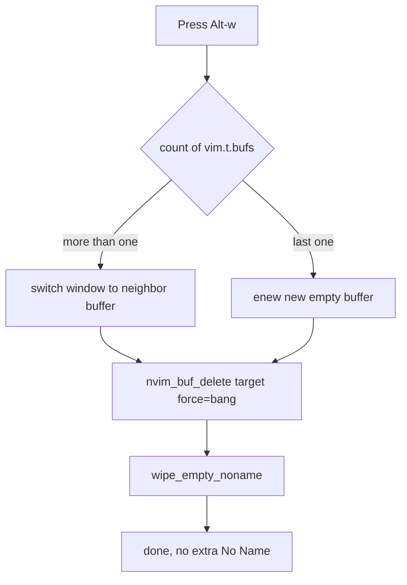

# Alt+w 一次關閉 buffer：雙重關閉問題的根因與修正

## WHY — 為什麼要寫這篇？痛點是什麼？

你有沒有遇過這種狀況：在 Neovim 裡按 `<A-w>` 想關掉目前的 buffer，結果**第一次按下去畫面沒關掉，反而變成一個空白的 buffer**，得再按一次才真的消失？

這不是錯覺，也不是手殘。它是設定層的兩個 bug 疊在一起造成的「假性沒關掉」。本篇要回答的核心問題是：

> 為什麼某些 buffer 要按兩次 `<A-w>` 才關得掉？第一次那個空白 buffer 是哪來的？

先講結論：**第一次其實「沒有把目標真的關掉」**（被存檔提示卡住），同時又「多生了一個空 No Name buffer」（撐 window 用），兩件事一起發生，看起來就像關了一半。下面我們一層一層拆開。

---

## HOW — 原理與根因

### 蘇格拉底式提問一：`<A-w>` 到底呼叫了什麼？

原本 `<A-w>` 以及 `:bd` / `:bd!` 都是走 NvChad 內建的：

```
require("nvchad.tabufline").close_buffer()
```

問題就藏在這個函式的「簽名」裡。

### 根因 1：`close_buffer` 根本沒有 force 參數

NvChad 的 `close_buffer` 實際簽名只有 `close_buffer(bufnr)`——它**只接受一個 buffer 編號，沒有第二個 `force` 參數**。

先前的設定卻誤以為可以把 bang（`!`）傳進去當 force 用。結果就是：`:Bd!` 的那個驚嘆號根本沒有生效。當遇到**未存檔的 buffer**或 **terminal buffer** 時，`close_buffer` 會走：

```
vim.cmd("confirm bd")
```

`confirm bd` 會彈出「是否要儲存？」的互動提示，把關閉流程卡住。在某些情況下，這一次的按鍵等於「什麼都沒關到」，於是你只好再按一次。**這就是「要按兩次」的第一個來源。**

### 根因 2：關到最後一個 buffer 時，會 `enew` 一個空 No Name

`close_buffer` 在關掉「最後一個 buffer」時，會 `enew` 出一個空的 No Name buffer 來撐住 window。

這裡接著問——

### 蘇格拉底式提問二：為什麼關最後一個 buffer，一定會留下一個空 buffer？

答案是 Neovim 的硬性限制：**window 不能沒有任何 buffer 可顯示**。一個 window 必須掛著某個 buffer，當你把唯一剩下的 buffer 關掉時，Neovim 沒有別的 buffer 可以放進這個 window，只好生一個全新的空 No Name 頂上去。所以——

> 關最後一個 buffer 留下一個空白 buffer，是「不可避免」的正常行為，不是 bug。

但 bug 在於：原本有一個清理函式只負責掃掉「**沒在顯示**的空 No Name」。而 `close_buffer` 生出來的那個 No Name **正顯示在 window 中**，於是它躲過了清理，賴著不走。視覺上看起來就是「沒關乾淨」。**這就是那個多餘空白 buffer 的來源。**

兩個根因合起來，使用者看到的就是：按一次 → 目標沒關掉（卡 confirm 或殘留）→ 出現一個空白 buffer → 再按一次才正常。

---

## WHAT — 修正方案與具體機制

修正已實作於 `lua/mappings.lua`，並完成實機驗證。核心是用自製的 `close_current_buffer(force)` 取代 NvChad 的 `close_buffer`。

### 新流程做了三件事

1. **先切鄰居，能不 `enew` 就不 `enew`**：先把當前 window 切到 `vim.t.bufs` 裡的鄰居 buffer。只要還有多個 buffer，就**絕不 `enew`**，所以不會再冒出多餘的 No Name。
2. **真正 force 刪除**：用 `vim.api.nvim_buf_delete(target, { force = bang })` 刪掉目標。當 `force = true` 時，直接丟棄未存檔內容、**不彈 confirm**，所以「一次到位」。
3. **收尾清理**：最後呼叫 `wipe_empty_noname()` 收掉那些沒在顯示的空 No Name 殘留。

只有在真的關到最後一個 buffer 時才會 `enew`——此時 window 一定要顯示東西，No Name 無法避免，屬於前面說過的正常行為。

### 流程圖



### 鍵位與命令對應

- **`<A-w>`** 在 normal / insert / terminal 三種模式都綁到 force 關閉（等同 `:bd!`）；其中 insert / terminal 模式會先 `stopinsert` 再關。
- **`:bd` / `:bd!`** 透過 `cnoreabbrev`，在「整行剛好是 `bd` 或 `bd!`」時改寫成 `:Bd` / `:Bd!`，避免誤觸其他含 `bd` 字樣的命令。

### 實機驗證結果

- 開啟 3 個檔案，連續按 `Bd!`，數量乾淨遞減：**3 → 2 → 1**，過程中**不產生任何多餘 No Name**。
- 關到最後一個時才出現**唯一一個** No Name（不可避免、屬正常）。
- 對那個 No Name 再按 `Bd!`，**不會增生**新的空 buffer。
- 對「已修改但未存檔」的 buffer 按 `Bd!`，**直接丟棄、不卡 confirm**——驗證 `force` 確實生效。

---

## 一句話總結

雙重關閉的根因是「force 從未生效（卡 confirm）」加上「正在顯示的空 No Name 躲過清理」；修正方式是先切鄰居避免多餘 `enew`、用 `nvim_buf_delete` 帶 `force` 真正刪除、再 `wipe_empty_noname` 收尾，達成「一次到位」。

---

## 延伸閱讀

- [Buffer 顯示名稱機制](BUFFER_DISPLAY_NAME.md)
