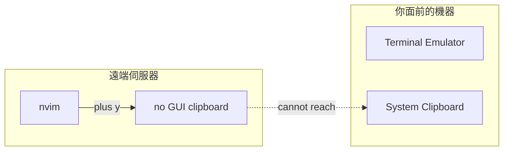
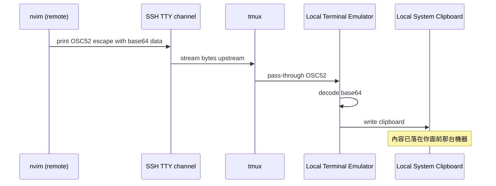

# 剪貼簿升級：tmux + SSH 下複製到本機系統剪貼簿（OSC52）

## WHY — 為什麼需要這個？先說痛點

先問一個你可能踩過的坑：

> 「我 SSH 進遠端機器、在 tmux 裡開 nvim，按了 `"+y` 複製一段程式碼，回到本機卻貼不出來。為什麼？」

要回答這題，得先理解 `"+y`（複製到 `+` register／系統剪貼簿）到底在做什麼。傳統上，nvim 想寫進「系統剪貼簿」時，它會去呼叫**它自己所在那台機器**上的圖形剪貼簿工具：

- Windows 上的 `win32yank` / `clip.exe`
- macOS 上的 `pbcopy`
- Linux（Wayland）上的 `wl-copy`、（X11）上的 `xclip`

問題就在這句話裡的「**它自己所在那台機器**」。

當你 SSH 進遠端時，nvim 跑在**遠端**。而遠端通常是一台沒有桌面環境、沒有圖形剪貼簿的伺服器——根本沒有 `pbcopy`、沒有 `wl-copy`、剪貼簿無從談起。就算遠端真有剪貼簿，那也是**遠端的剪貼簿**，跟你面前這台筆電的剪貼簿是兩回事。你複製的東西，被存進了一個你碰不到的地方。



**這就是痛點：複製的內容到不了你面前的系統剪貼簿。** 而我們真正想要的，是「在遠端 nvim 按一下，內容就出現在本機剪貼簿，能在瀏覽器、聊天視窗、別的程式裡直接貼上」。

OSC52 就是為了解決這件事而生。

---

## HOW — 原理：OSC52 怎麼讓資料「沿著終端機回流」？

### 先問：本機的終端機，是不是早就連著本機剪貼簿？

是的。你面前那台機器跑的**終端機模擬器**（Windows Terminal、iTerm2、kitty、wezterm、iPad 上的 Blink、Mintty 等），本來就是本機的圖形程式，它**天生就能存取本機系統剪貼簿**。

那關鍵問題就變成：

> 「遠端 nvim 有沒有辦法『拜託本機終端機』幫忙把資料寫進剪貼簿？」

有。這就是 **OSC52**。

### OSC52 是什麼？

OSC = Operating System Command，是一類終端機**跳脫序列（escape sequence）**。OSC52 專門用來操作剪貼簿，它的格式長這樣（概念示意）：

```
ESC ] 52 ; c ; <base64 編碼後的資料> BEL
```

機制其實很樸素：

1. nvim 要複製的文字，先做 **base64 編碼**（避免特殊字元破壞終端機協定）。
2. nvim 把這串資料包進 OSC52 跳脫序列，當成普通輸出「**印**」到終端機。
3. 這串「輸出」沿著 **SSH 既有的 TTY 通道**一路回流到你本機。
4. 你本機的終端機模擬器看到 OSC52，知道「這是要寫剪貼簿的指令」，於是**攔截**它，解 base64，寫進**本機**系統剪貼簿。

最漂亮的地方在於：**它完全走既有的 TTY 通道**。

- 不需要遠端安裝任何剪貼簿程式。
- 不需要開反向通道、不需要額外的 port、不需要 X11 forwarding。
- 資料就跟「終端機畫面上的字」走同一條路回來。



### tmux 在中間扮演什麼角色？

注意上圖中間多了一個 `tmux`。當你的連線是「SSH → tmux → nvim」時，那串 OSC52 序列在抵達本機終端機之前，**得先穿過 tmux**。

tmux 預設可能會把這種剪貼簿序列**吞掉**（不轉發），於是資料卡在 tmux 那層、永遠到不了本機終端機。所以要明確告訴 tmux：「請幫我把剪貼簿序列傳出去。」這就是後面 `set -g set-clipboard on` 的用途。

### 再問：那「貼回來（paste）」呢？能不能反向讀剪貼簿？

OSC52 理論上也支援「讀」剪貼簿（讓遠端 nvim 反向讀回本機剪貼簿內容）。但現實是：**大多數終端機基於安全考量，預設不允許 OSC52 讀回**——否則遠端那台機器就能偷偷把你本機剪貼簿的內容（可能含密碼）抽走，這顯然危險。

所以本設定的策略是：

- **複製（copy）**：走 OSC52，送到本機剪貼簿。
- **貼上（paste）**：OSC52 讀回不可靠，因此 nvim 的 paste 改用**自身 register 當 fallback**（在 nvim 內部貼上沒問題）。
- **跨程式貼上**：請直接用**終端機自己的貼上鍵**（`Ctrl+Shift+V` / `Cmd+V`），讓本機終端機把本機剪貼簿內容送進來。

---

## WHAT — 具體做了什麼 & 怎麼用

### 本 repo 的實作

設定位於 `lua/configs/clipboard.lua`，由 `lua/options.lua` 呼叫其 `setup()`。核心邏輯是**自動偵測環境，挑對的 provider**：

| 偵測情境 | 判斷依據 | 採用的 clipboard provider |
|----------|----------|----------------------------|
| 遠端（SSH session） | 環境變數 `SSH_TTY` / `SSH_CONNECTION` / `SSH_CLIENT` 任一存在 | 把 `+` 與 `*` register 接到 OSC52（`require("vim.ui.clipboard.osc52")`） |
| 本機且有原生剪貼簿工具 | 偵測到 `win32yank` / `pbcopy` / `wl-copy` / `xclip` / `clip.exe` | **不覆蓋**，沿用 nvim 原生 provider（本機貼回比較順） |

換句話說：**人在遠端就用 OSC52，人在本機就用原生工具**，不用自己手動切。Neovim 0.11.5 內建 `vim.ui.clipboard.osc52`，無需額外外掛。

> 為什麼本機不直接也用 OSC52？因為本機原生 provider 在「貼回」這件事上更順（OSC52 讀回受限，見上文）。本機既然有原生工具可用，就用更完整的那條路。

### 按鍵：不用記太多

設計原則是「好記、少記」。把最常用的「整個檔案複製到系統剪貼簿」做成一個鍵：

| 鍵 | 模式 | 行為 |
|----|------|------|
| `<leader>Y` | normal | **整個檔案**複製到系統剪貼簿（等同你習慣的 ctrl-a, ctrl-c 全選複製） |
| `<leader>y` | visual | 把**選取範圍**複製到系統剪貼簿 |
| `<leader>y` | normal | 複製**當前行**到系統剪貼簿 |

熟手仍可使用原生寫法：`"+y`（複製選取／motion 到系統剪貼簿）、`"+yy`（複製整行）。這些一樣會走上面偵測出的 provider。

### tmux.conf 一次性設定

把以下加進你的 `~/.tmux.conf`：

```tmux
# 允許 tmux 將剪貼簿序列（OSC52）轉發出去
set -g set-clipboard on

# tmux < 3.3 可能還需要這行，讓底層程式的跳脫序列穿透 tmux
set -g allow-passthrough on
```

改完後重新載入設定（在 tmux 內執行）：

```tmux
tmux source-file ~/.tmux.conf
```

### 驗證步驟（Checklist）

依序確認，哪一步壞掉就知道問題出在哪一層：

1. **確認終端機本身支援 OSC52 寫入剪貼簿。** Windows Terminal、iTerm2、kitty、wezterm、Blink（iPad）都支援 OSC52 copy；請到各自設定確認 **clipboard write 已開啟**。
2. **確認 tmux 已設定。** 在 tmux 內檢查 `set-clipboard on`（必要時加 `allow-passthrough on`），並已 `source-file` 重新載入。
3. **確認 nvim 在遠端有走 OSC52。** SSH 進遠端、進 tmux、開 nvim，確認 SSH 環境變數存在（`SSH_TTY` / `SSH_CONNECTION` / `SSH_CLIENT`），此時 `lua/configs/clipboard.lua` 應已把 `+`/`*` 接到 OSC52 provider。
4. **實測複製。** 在遠端 nvim 用 `<leader>Y`（整檔）或 visual `<leader>y`（選取），切回**本機**任一程式（瀏覽器、聊天視窗），用終端機貼上鍵（`Ctrl+Shift+V` / `Cmd+V`）貼上，確認內容正確。
5. **若貼不出來，逐層回推：** 終端機剪貼簿寫入設定 → tmux 轉發設定 → SSH 環境變數偵測 → nvim provider 是否真的接上。

---

## 延伸閱讀

- [`lua/configs/clipboard.lua`](../lua/configs/clipboard.lua) — 本功能的實作（環境偵測與 provider 選擇）
- [`docs/PLATFORM_KEY_NORMALIZATION.md`](./PLATFORM_KEY_NORMALIZATION.md) — 跨平台按鍵正規化說明
