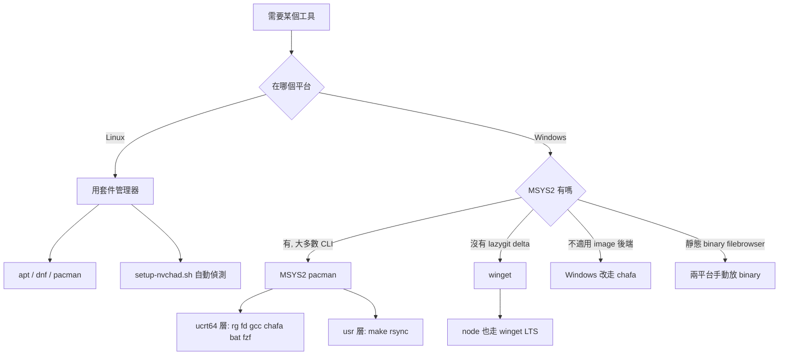
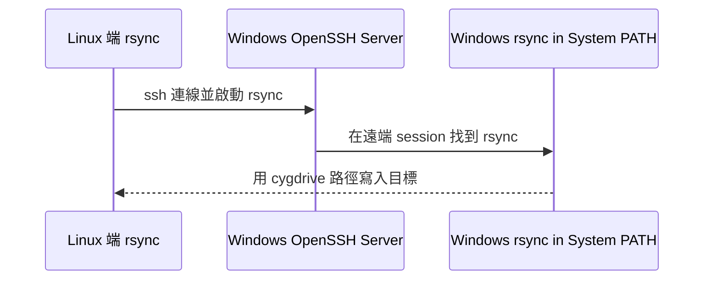

# 跨平台依賴與安裝維護指南

> 本文是 `README.md` 中「跨平台依賴清單」表格的**深入版說明**。
> 表格是「真相來源（source of truth）」，本文負責解釋 **為什麼**、**怎麼運作**、以及 **誰裝不了、為什麼裝不了**。

---

## WHY：為什麼同一套工具，在兩個平台要從不同地方裝？

先丟一個問題給你：

> 「`ripgrep`、`fd`、`gcc` 這些工具，明明在 Linux 上一行 `apt install` 就好，為什麼到了 Windows 反而要先裝一個叫 MSYS2 的東西？不能直接 `winget` 或下載 exe 嗎？」

痛點來自三件事：

1. **Neovim 的外掛預期一個「類 Unix 的工具鏈」**：telescope 要 `rg`/`fd`、treesitter 要 `gcc`/`make` 編 parser、image 預覽要 `chafa`。這些工具在 Linux 是一等公民，在 Windows 卻是「外來戶」。
2. **Windows 沒有統一的套件管理器傳統**：Linux 有 `apt`/`dnf`/`pacman`，裝什麼都一致。Windows 上同一個工具可能來自 winget、scoop、各家 exe、或某個 Unix 相容層，**來源不一致就會踩到版本與相容性的坑**。
3. **「相容層」之間也會打架**：Windows 上的 Unix 工具有 Cygwin、MSYS2、Git for Windows 內建的 bash 等多套。它們各自帶一份 runtime，混用就會出現「編出來的東西在 A 跑得動、在 B 閃退」的詭異現象（後面 treesitter 的坑就是這個）。

所以本 repo 的策略是：

- **Linux**：信任原生套件管理器（`apt` / `dnf` / `pacman`），它最懂自己的平台。
- **Windows**：用 **MSYS2 ucrt64** 當作「主要的類 Unix 工具來源」，集中管理大部分 CLI 工具；只有 MSYS2 真的沒有、或不適用的，才退回 `winget` 或手動放 binary。

換句話說，不是「Windows 比較麻煩」，而是「Windows 需要先選定一個一致的工具來源，避免相容層互相干擾」。

---

## HOW：MSYS2 的分層，與「來源決策」的機制

### 蘇格拉底式追問：MSYS2 裡為什麼還分 `usr` 和 `ucrt64`？

> 「都已經裝了 MSYS2，為什麼 `make` 在 `usr/bin`，但 `gcc` 卻要用 `ucrt64`？同一個 MSYS2 怎麼還分兩層？」

因為 MSYS2 內部其實有**多個 runtime 環境**，本 repo 只用到兩層：

- **`usr` 層（MSYS2 runtime）**：偏向「POSIX 相容」的工具，例如 `make`（`usr/bin/make.exe`）、`rsync`。它走的是 MSYS2 自己的 POSIX 模擬層。
- **`ucrt64` 層（原生 Windows + UCRT）**：產出**原生 Windows 執行檔**的工具鏈，例如 `gcc`、`ripgrep`、`fd`、`chafa`、`bat`、`fzf`。這層編出來的二進位檔是給 Windows 原生程式（含 Neovim）用的。

這個分層直接決定了一個關鍵的坑：

- `make`：**用 `usr` 層**的 `usr/bin/make.exe`。注意 `ucrt64` **只有 `mingw32-make.exe`**，名字不一樣，treesitter 編譯流程要的是 `make`。
- `gcc`：**一定要用 `ucrt64` 的 gcc**。

### 為什麼 gcc 非 ucrt64 不可？（treesitter 閃退的真兇）

> 「gcc 不就是 gcc 嗎？Cygwin 的 gcc 也能編 C，為什麼不能拿來編 treesitter parser？」

因為 treesitter parser 是**動態載入回 Neovim 進程**的。如果用 **Cygwin gcc** 編，產出的二進位會依賴 Cygwin 的 runtime，與原生 Windows 的 Neovim **ABI / runtime 不相容**，載入時直接**閃退**。`ucrt64` gcc 產出的才是原生 Windows 相容的二進位。

> 這個坑的完整追查紀錄見 `docs/TREESITTER_CYGWIN_CRASH.md`。

### 來源決策樹

---

## WHAT：各工具、各平台的安裝清單與坑

### 一、走「主要來源」的常規工具

| 工具 | Windows 來源 | Linux 來源 | 備註 |
|------|--------------|-----------|------|
| `ripgrep` (`rg`) | MSYS2 **ucrt64**（pacman） | apt / dnf / pacman | telescope 搜尋必備 |
| `fd` | MSYS2 **ucrt64** | apt / dnf / pacman | apt 套件名為 `fd-find`，執行檔是 `fdfind`，見下方註解 |
| `gcc` | MSYS2 **ucrt64**（**禁用 Cygwin gcc**） | apt / dnf / pacman | treesitter 編 parser |
| `make` | MSYS2 **usr** 層（`usr/bin/make.exe`） | apt / dnf / pacman | ucrt64 只有 `mingw32-make.exe`，名字對不上 |
| `chafa` | MSYS2 **ucrt64** | apt / dnf / pacman | 圖片預覽（見 image 後端段落） |
| `bat` | MSYS2 **ucrt64** | apt / dnf / pacman | |
| `fzf` | MSYS2 **ucrt64** | apt / dnf / pacman | |
| `rsync` | MSYS2 **usr** 層（`pacman -S rsync`） | apt / dnf / pacman | Windows 真的裝得起來，見 rsync 專章 |

> **`fd-find` 的執行檔名坑**：在 apt 系統上套件叫 `fd-find`，但實際執行檔是 `fdfind`（不是 `fd`）。本 repo 的 `bootstrap.lua` 會**自動探測** `fd` / `fdfind`，所以你不需要手動建 symlink。

### 二、不走 MSYS2 的工具（為什麼）

| 工具 | Windows 來源 | 為什麼不走 MSYS2 |
|------|--------------|------------------|
| Node.js LTS | **winget**：`OpenJS.NodeJS.LTS`（**不靠 scoop**） | markdown-preview 執行期需要 Node；用 winget 取得官方 LTS。Linux 走 nodesource 或套件管理器 |
| `lazygit` | **winget**：`JesseDuffield.lazygit` | MSYS2 repo **沒有** lazygit |
| `git-delta` | **winget**：`dandavison.delta` | MSYS2 repo 沒有這個工具；MSYS2 裡叫 `delta` 的**是另一個壓縮庫**，不是 git diff 美化工具，裝錯會誤導 |
| `git` | **刻意不裝**（用既有的 Git for Windows） | install-msys2 故意不裝 git，**避免第二個 git 搶 bash 的優先序**；Windows 通常本來就有 Git for Windows |
| `filebrowser` | **手動放 binary**（兩平台皆是） | 靜態 Go 執行檔，**零 runtime 依賴**，不需要套件管理器 |

### 三、剪貼簿與圖片後端（平台差異）

- **剪貼簿 provider**
  - Windows：用 Neovim **內建的 `win32yank`**，開箱即用。
  - Linux：改走 **OSC52**（終端跳脫序列）/ `wl-copy`（Wayland）/ `xclip`（X11）。
- **image.nvim 後端**
  - Linux：可用 `ueberzug` 或 `kitty` graphics protocol。
  - Windows：**不適用**——Windows 沒有 `ueberzug`，所以**一律走 `chafa`**（以字元/區塊近似呈現圖片）。

---

## 重申：哪些是「無法安裝 / 不適用」的案例？

「跨平台依賴清單」表格裡標記為**無法安裝**的，主要是這三類，請特別記住：

1. **`lazygit`**：MSYS2 repo 沒有 → Windows 改用 winget（`JesseDuffield.lazygit`）。
2. **`git-delta`**：MSYS2 repo 沒有，且 MSYS2 的 `delta` 是**不相干的壓縮庫** → Windows 改用 winget（`dandavison.delta`）。
3. **image.nvim 的 `ueberzug` / `kitty` 後端**：Windows **不適用** → 一律降級走 `chafa`。

這三個案例的共同教訓：**「在 Linux 理所當然的東西，在 Windows 不一定有對等品」**，遇到時要嘛換來源（winget），要嘛換實作（chafa）。

---

## rsync 專章：把它當成 scp 的替代品

> 「我在 Linux yank 慣了 rsync，到 Windows 是不是只能用 scp？」

不用。**Windows 也能裝 rsync**，就在 MSYS2 的 **usr 層**（`pacman -S rsync`）。

`install-msys2.ps1` 會把 `C:\msys64\usr\bin` 同時寫進：

- **User PATH**：讓你在自己的終端直接用 `rsync`。
- **System PATH**：這一步是關鍵——**為了讓 SSH 遠端登入進來的 session 也找得到 rsync**（遠端登入不會載入你的 User 環境）。

### 場景：把檔案從 Linux 推到 Windows

當 Windows 是**接收端**時：

要點（腳本已幫你處理大半）：

- Windows 端要**開啟 OpenSSH Server**。
- Windows 端的 `rsync` 必須在 **System PATH**（`install-msys2.ps1` 已寫入，並會**重啟 sshd**讓設定生效）。
- 目標路徑用 **`/cygdrive/c/...`** 風格（例如 `C:\Users\...` 寫成 `/cygdrive/c/Users/...`）。

本機自己用 rsync 則沒有上述限制，直接用即可。

---

## 一鍵安裝腳本

| 平台 | 腳本 | 做了什麼 |
|------|------|----------|
| Windows | `window_tool_script/install-msys2.ps1` | 一鍵裝 MSYS2 + 上述 ucrt64/usr 工具 + Node + 寫入 User/System PATH + 重啟 sshd |
| Linux | `setup-nvchad.sh` | 偵測 `apt`/`dnf`/`pacman`，安裝 `git`、`curl`、`wget`、`build-essential`、`gcc`、`make`、`ripgrep`、`fd-find`、`chafa`、`bat`、`fzf`、`rsync` 等 |

> 提醒：Linux 上 apt 的 `fd` 套件名是 `fd-find`、執行檔是 `fdfind`，`bootstrap.lua` 會自動探測，無須手動處理。

---

## 延伸閱讀

- [`docs/MSYS2_SETUP_GUIDE.md`](./MSYS2_SETUP_GUIDE.md) — MSYS2 安裝與 ucrt64/usr 分層的詳細步驟
- [`docs/TREESITTER_CYGWIN_CRASH.md`](./TREESITTER_CYGWIN_CRASH.md) — 為什麼 gcc 一定要用 ucrt64、Cygwin gcc 導致閃退的追查
- [`README.md`](../README.md) — 「跨平台依賴清單」表格（真相來源）
