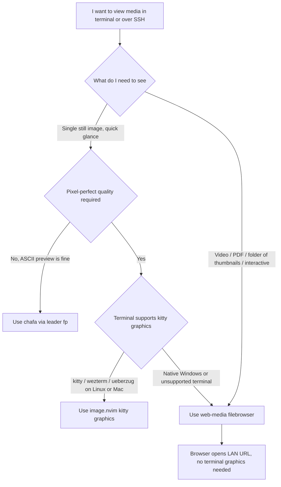
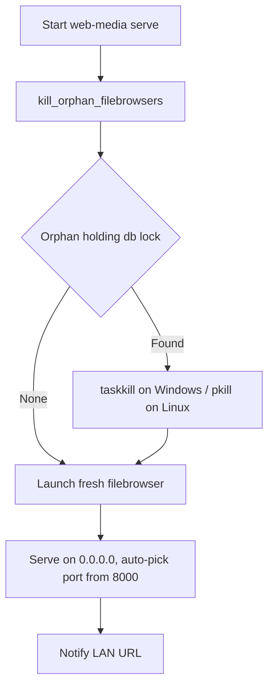

# 終端多媒體顯示與 SSH 下瀏覽：能力矩陣與 web-media 深入說明

> 一份關於「在終端機 / SSH 環境裡到底要怎麼看圖片、影片、PDF」的決策指南。
> 涵蓋本 repo 兩個互補功能（圖片預覽 `<leader>fp`、網頁多媒體 `<leader>fs`），並彙整跨工具的能力矩陣。

---

## WHY — 為什麼這是個問題？

先問一個最根本的問題：

> 「我都已經能用 SSH 登入遠端機器了，為什麼還是看不到那台機器上的圖片？」

因為 **SSH 傳的是文字（character stream），不是畫面（framebuffer）**。終端機天生只認得字元格與 ANSI 跳脫序列，它沒有「把一塊 RGB 點陣圖貼上去」的內建概念。於是衍生出幾個典型痛點：

- **遠端開發看不到產出**：在 Jetson、雲端 GPU、或別人的伺服器上跑完一張結果圖 / 一段推論影片，想確認長相，卻只能 `scp` 拉回本機再開，來回很煩。
- **手機 / iPad 工作流斷裂**：用 Blink（iPadOS 的 SSH client）連線時，根本沒有桌面 GUI 可以開圖。
- **高畫質方案綁終端**：kitty graphics protocol 之類的方案畫質很好，但它要求「終端機本身」支援該協定，一旦你的模擬終端或中繼環節不支援，整條路就斷了。
- **Windows 原生環境更尷尬**：沒有 `ueberzug`，許多 Linux 上理所當然的 inline image 方案直接不能用。

再追問一句更刁鑽的：

> 「為什麼遠端 yank 到不了本機剪貼簿、遠端圖片也貼不回本機螢幕？」

本質是同一件事：**終端通道是純文字的單向字元流，畫面與剪貼簿這種『帶外資料』需要額外協定或額外通道才能跨越這條界線**。理解了這點，你就會發現解法只有兩條路：

1. **把圖片『降維』成終端認得的字元**（ANSI 彩色字元畫）——這就是 chafa 走的路。
2. **不要勉強終端去顯示，改用一個它本來就擅長的東西當顯示層**——瀏覽器。這就是 web-media 走的路。

本 repo 同時提供這兩條路，讓你按情境挑。

---

## HOW — 兩條路的原理

### 路線 A：chafa 把圖片降維成字元（終端機內顯示）

`lua/configs/image_preview.lua` 的做法是：用 **Telescope** 當挑檔 UI，預覽時把圖片丟給 **chafa** 轉成 ASCII / ANSI 彩色字元，直接畫在「終端機內」。

關鍵在於：它輸出的就只是字元 + ANSI 色碼，**任何能顯示 ANSI 的終端都吃得下**——不需要 kitty graphics protocol、不需要 GUI、不需要 ueberzug。代價是畫質受限於終端的字元解析度，看細節不行，但「快速翻單張圖、確認大致長相、不離開 nvim」綽綽有餘。

### 路線 B：web-media 用瀏覽器當顯示層（SSH 下的最佳解）

`lua/configs/web_media.lua` 的做法是：用 **filebrowser**（一個單一靜態 Go 執行檔）把指定資料夾「服務」出來，在瀏覽器裡看縮圖牆、圖片 / 影片 / PDF viewer、還能搜尋。

它最聰明的一點是 **把顯示這件事整個外包給瀏覽器**——終端完全不負責畫圖，所以它不在乎終端支不支援任何 graphics protocol。只要終端那頭（或同網段的另一台裝置）能開瀏覽器，就能看。這也是為什麼它在 SSH 遠端、Jetson、手機上都能用。

下面這張決策圖，幫你在「我現在到底該用哪一條」時快速選擇：

---

## WHAT — 能力矩陣與具體操作

### 能力矩陣

維度說明：**本機** = 在本地端直接跑；**SSH** = 透過 SSH 遠端使用；**終端工具(chafa)** = 是否依賴 chafa；**模擬終端機** = 對終端模擬器的需求；**MSYS2 / 原生 Windows / Blink(iPadOS)** = 各環境支援度。

| 方案 | 本機 | SSH | 終端工具(chafa) | 模擬終端機需求 | MSYS2 | 原生 Windows | Blink (iPadOS) | 備註 |
|------|:----:|:---:|:---------------:|----------------|:-----:|:------------:|:--------------:|------|
| **chafa（ASCII / ANSI）** `<leader>fp` | ✅ | ✅ | 依賴 chafa | 只要能顯示 ANSI 即可 | ✅ | ✅（Windows Terminal 可顯示 ANSI） | ✅（iPad） | 畫質受限於終端字元解析度，適合快速翻單張圖 |
| **kitty graphics / image.nvim（高畫質）** | ✅(Linux/Mac) | ⚠️ | 否 | 需 kitty / wezterm / ueberzug | — | ❌（無 ueberzug，本 repo 以 `cond` 在 win32 關閉 image.nvim） | ⚠️(部分支援 kitty graphics) | SSH 需終端本身支援 graphics protocol |
| **web-media（filebrowser 瀏覽器）** `<leader>fs` | ✅ | ✅（瀏覽器連區網 / tunnel） | 否 | 不靠終端 graphics，只要能開瀏覽器 | ✅ | ✅ | ✅（iPad 開瀏覽器即可） | 另支援 Jetson ✅；**SSH 下看影片 / PDF / 互動的最佳解** |

一句話總結：

- 想**快速瞄一張圖、不離開 nvim** → `<leader>fp`（chafa）。
- 想**看影片 / PDF / 整個資料夾縮圖牆 / 在 SSH 或手機上看** → `<leader>fs`（web-media）。
- 想要**像素級高畫質**且你人在 Linux/Mac + kitty/wezterm → image.nvim 路線（原生 Windows 不可用）。

### 路線 A 操作：圖片預覽 `<leader>fp`

- 入口：`<leader>fp`。
- 機制：Telescope 挑檔 + chafa 轉字元，顯示在終端機內。
- 支援格式：PNG / JPG / GIF / WebP / BMP / SVG / ICO / TIFF。
- 驗證過的環境：MSYS2 Mintty、SSH（iPad Blink）。
- 不依賴 kitty graphics、不依賴 GUI。

### 路線 B 操作：網頁多媒體 web-media

| 鍵 / 指令 | 行為 |
|-----------|------|
| `<leader>fs` | 服務「當前 tab 的 cwd」這個資料夾 |
| `<leader>fS` | 手動輸入要服務的路徑 |
| `:WebMediaStop` | 停止服務 |

它做了什麼（事實）：

- 用 **filebrowser**（單一靜態 Go 執行檔）把資料夾丟到瀏覽器，看**縮圖牆 + 圖片 / 影片 / PDF viewer + 搜尋**。
- 綁 `0.0.0.0`，**同網段可連**；啟動後 notify 會列出區網網址。
- **免登入**（`auth=noauth`）。
- **自動找空 port**（從 8000 起）。
- **離開 nvim 自動關閉**服務。
- 需求只有兩個：**Neovim >= 0.10** 與**一個瀏覽器**。

#### 為什麼它能「跨平台同一份程式碼」？

這裡值得停下來問：

> 「同一份 Lua，怎麼可能在 Windows、Linux、Jetson、iPad 後端都跑得起來？」

因為它把所有平台相關動作都委派給 Neovim 內建、已經抹平平台差異的 API：

- 抓 IP → `vim.uv.interface_addresses`
- 開瀏覽器 → `vim.ui.open`
- 找空 port → `vim.uv`

於是 Lua 端邏輯完全一致，**唯一的平台差異只剩「下載對應平台的 filebrowser binary」**。

---

## Windows 已知坑：web-media「突然不能用」的真因

這一節是剛診斷出來並已修復的實況紀錄，遇到問題請先看這裡。

先破除一個直覺誤解：

> 「突然不能用，是不是找不到 `filebrowser.exe`？」

**通常不是。** 診斷時 `exepath` 找得到 `filebrowser.exe`，`filebrowser.db` 也好端端在 `~/.config/filebrowser/filebrowser.db`。

真正的元兇是 **殘留的 `filebrowser.exe` 孤兒進程鎖住了 bbolt 資料庫**：

- 上次 nvim **非正常結束**時，`VimLeavePre` 裡負責收尾的 `jobstop` 沒跑到。
- 結果 filebrowser 變成孤兒進程，一直持有 bbolt db 的**單寫鎖**。
- 之後每次想啟動新的 filebrowser，都因為**開不了被鎖住的 db**，以 `code 1` 退出 → 表現出來就是「突然不能用」。

### 怎麼確認是這個坑？

- 跑 `filebrowser users ls -d <db>`，若回 `Error: timeout` → 代表 **db 被鎖住**。
- 在工作管理員、或 `Get-Process filebrowser` 看得到**孤兒進程**還活著。

### 已修復的行為

`web_media.lua` 現在會在 serve 之前先呼叫 `kill_orphan_filebrowsers()` 自動清孤兒：

- Windows：`taskkill /F /IM filebrowser.exe`
- Linux：`pkill -f filebrowser`

同時也改善了錯誤訊息，讓問題更好辨識。

### Windows 準備事項清單

1. 下載 `windows-amd64-filebrowser.zip`，解出 `filebrowser.exe` 放到 **PATH**（或 `~/.local/bin`；本 repo 的 `.local/bin` 已加入 User PATH）。
2. 準備**一個瀏覽器**。
3. 若曾經卡住：關掉殘留的 `filebrowser.exe`，或直接刪掉 `filebrowser.db`（會自動重建）。

---

## 附錄：SAM_Annotate 瀏覽頁面比較（待補）

> **SAM_Annotate 比較：待確認正確 repo 連結後補上。**

說明：經 GitHub API 查證，`HANK572718` 帳號下目前**並沒有名為 `SAM_Annotate` 的 repo**（該帳號 22 個公開 repo 中找不到此名稱；最接近的是 `sam3`，但那是 Segment Anything 模型的 fork，並非 viewer）。為避免杜撰，此比較暫時無法進行，待提供正確 repo 連結後再補。

不過，**評估「把另一套瀏覽頁面搬過來」的成本時，應該先看這些點**（checklist）：

- [ ] **前端框架是什麼？** Flask / Gradio / 純靜態（static）？框架越重、搬移成本越高。
- [ ] **縮圖策略為何？** 是即時產生、預先快取、還是交給瀏覽器縮放？牽涉效能與依賴。
- [ ] **單檔可移植，還是要拖整套框架 + 依賴？** 能不能像 filebrowser 那樣「一個 binary / 一份程式碼」帶著走？
- [ ] **是否需要 build step？** 有沒有打包、編譯、前端 bundling 等前置步驟，會影響跨平台與 CI 的可行性。

把這幾點對照本 repo 現有的 web-media（單一 Go 執行檔、無 build step、跨平台同一份 Lua），就能客觀評估搬移是否划算。

---

## 延伸閱讀

- [IMAGE_PREVIEW_GUIDE.md](../IMAGE_PREVIEW_GUIDE.md) — 圖片預覽（chafa）完整指南
- [WEB_MEDIA_GUIDE.md](../WEB_MEDIA_GUIDE.md) — 網頁多媒體（filebrowser）完整指南
