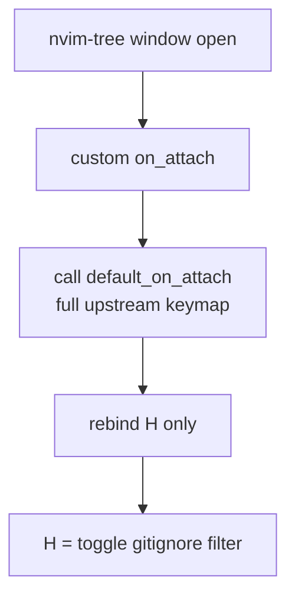

# nvim-tree 快捷鍵完整學習清單

> 目標：把 nvim-tree（檔案樹）的所有預設快捷鍵一次學完、彙整成一份可隨手查的清單，並弄懂本 repo 唯一的一個客製差異（`H`）。

---

## WHY — 為什麼要專門整理一份快捷鍵清單？

先問自己一個問題：

> **「我每天都在用檔案樹開檔案，為什麼還需要學快捷鍵？滑鼠點一點不就好了？」**

因為 nvim-tree 不只是「點開檔案」的工具。它其實是一個**完整的檔案管理器**：新增、刪除、改名、剪下貼上、複製路徑、即時過濾、搜尋、git 變更導航、書籤……這些操作如果你不知道按鍵，就只能切到別的視窗、用別的工具，反而打斷心流。

第二個痛點更隱形：

> **「nvim-tree 的按鍵不是 NvChad 自己發明的，那它到底長怎樣？我去哪裡找權威清單？」**

本設定（NvChad v2.5 base）的客製方式是：在 `lua/plugins/init.lua` 寫了一個自訂 `on_attach`，但它**第一件事就是先呼叫上游的 `default_on_attach`**（把整套官方預設鍵全部綁好），**接著只額外重綁一個 `H`**。所以淨效果等於「**完整上游預設鍵 + 唯一一個 `H` 客製**」。這代表：

1. 網路上 nvim-tree 官方文件列的鍵，幾乎都能直接套用。
2. 但本 repo 動了**唯一一個客製**——把 `H` 改掉了。如果你照官方文件記，`H` 會記錯。

所以這份清單的價值，就是：**以上游預設為基準，把客製差異標清楚，讓你記一次就對。**

---

## HOW — 這些按鍵是怎麼來的？機制是什麼？

### 按鍵從哪裡掛上去？

nvim-tree 在每個樹狀視窗開啟時，會呼叫一個 `on_attach` 函式，把所有按鍵綁到那個 buffer 上。你有兩種選擇：

- **不寫 `on_attach`** → nvim-tree 自動套用內建的 `default_on_attach`（一整套官方預設鍵）。
- **自己寫 `on_attach`** → 你得自己決定要綁什麼。

本設定走的是「**自己寫 `on_attach`，但先呼叫 `default_on_attach` 再加料**」的折衷：

```lua
-- lua/plugins/init.lua（節錄）
default_opts.on_attach = function(bufnr)
  original_on_attach(bufnr)          -- ① 先套用整套官方預設鍵
  vim.keymap.set("n", "H", function() -- ② 只重綁一個 H
    api.tree.toggle_gitignore_filter()
  end, { buffer = bufnr })
end
```

所以你拿到的是**完整官方預設鍵 + H 客製**，沒有缺漏。



### 那個唯一的客製：`H` 到底改了什麼？

這是本 repo 與原版 nvim-tree **唯一不同的地方**，務必記清楚：

| | 上游預設 | 本 repo 客製（見 `lua/plugins/init.lua`） |
|---|---|---|
| `H` | 切換 **dotfiles** filter（顯示/隱藏 `.` 開頭檔） | 切換 **gitignore** filter |

> **「為什麼要把 `H` 從 dotfiles 改成 gitignore？」**

因為本設定的 **dotfiles 預設就已經顯示**了——`.gitignore`、`.env`、`.config` 這類檔平常都看得到，沒必要再留一個鍵去切它。於是把這個按鍵釋放出來，改綁更實用的 gitignore filter（快速隱藏/顯示被 git 忽略的檔，例如 `node_modules`、build 產物）。

附帶提醒：上游另外還有一個 `I` 鍵本來就是切 gitignore filter，本設定保留它。所以在本 repo 裡，`H` 和 `I` 都會切 gitignore filter（兩個鍵效果相同），這是客製造成的「巧合重疊」，不是錯誤。

### 最重要的速查機制：`g?`

在記憶體裡硬背幾十個鍵很痛苦。所以先記**一個鍵**就好：

> **在樹內按 `g?`，會即時彈出當前生效的完整按鍵對照表。**

這是最可靠的速查方式——因為它顯示的是「實際綁定」，連客製過的 `H` 都會正確反映。背不起來時，`g?` 永遠是你的後盾。

---

## WHAT — 完整快捷鍵清單（分類表格）

以下全部在**樹狀視窗的 normal mode** 內按。

### 1. 開檔 / 導航（怎麼把檔案打開）

| 鍵 | 動作 |
|---|---|
| `<CR>` / `o` | 開啟檔案 / 展開資料夾 |
| `<Tab>` | 預覽（游標**留在樹**裡，方便連續預覽） |
| `<C-v>` | 垂直分割（vsplit）開啟 |
| `<C-x>` | 水平分割（split）開啟 |
| `<C-t>` | 新分頁（tab）開啟 |
| `<C-e>` | 在原地開啟（取代樹 buffer） |
| `O` | 不經 window picker，直接開 |

> 小技巧：`<Tab>` 預覽 vs `<CR>` 開啟的差別在於「游標去哪」。預覽時游標不離開樹，按上下就能一路掃過很多檔案。

### 2. 根目錄操作（移動「樹的視角」）

| 鍵 | 動作 |
|---|---|
| `<C-]>` | 以游標所在節點為新根（CD）；與**雙擊右鍵**同義 |
| `-` | 上一層當根 |
| `P` | 跳到父目錄 |

### 3. 兄弟 / 層級移動（在同一層或展開收合間跳）

| 鍵 | 動作 |
|---|---|
| `>` | 下一個兄弟節點 |
| `<` | 上一個兄弟節點 |
| `J` | 跳到最後一個兄弟 |
| `K` | 跳到第一個兄弟 |
| `E` | 全部展開 |
| `W` | 全部收合 |
| `L` | 切換「把空資料夾群組顯示」 |

### 4. 檔案操作（把樹當檔案管理器用）

| 鍵 | 動作 |
|---|---|
| `a` | 新增檔案或資料夾（結尾加 `/` 表資料夾） |
| `d` | 刪除 |
| `D` | 移到垃圾桶（trash） |
| `r` | 改名 |
| `e` | 改 basename |
| `<C-r>` | 改名但保留副檔名提示 |
| `u` | 改全路徑 |
| `x` | 剪下 |
| `c` | 複製 |
| `p` | 貼上 |
| `y` | 複製檔名 |
| `Y` | 複製相對路徑 |
| `gy` | 複製絕對路徑 |
| `ge` | 複製 basename |

> 複製路徑那組（`y` / `Y` / `gy` / `ge`）超實用：要把路徑貼到終端機、import 語句、commit 訊息時，不用手打。

### 5. 資訊 / 過濾 / 搜尋（控制「看到什麼」）

| 鍵 | 動作 | 備註 |
|---|---|---|
| `<C-k>` | 顯示節點資訊彈窗（檔案大小 / 權限 / 時間） | |
| `H` | **切換 gitignore filter** | ⚠️ **本 repo 客製**（上游是切 dotfiles） |
| `I` | 切換 gitignore filter | 上游預設；本 repo 與 `H` 效果相同 |
| `U` | 切換 hidden filter | |
| `B` | 只顯示「在 buffer 中的檔」 | |
| `C` | 切換 git clean 過濾 | |
| `M` | 只顯示書籤 | |
| `f` | 開始即時過濾（live filter，邊打邊濾） | |
| `F` | 清除即時過濾 | |
| `S` | 搜尋節點 | |

### 6. git / 診斷導航（在變更與錯誤間跳）

| 鍵 | 動作 |
|---|---|
| `[c` | 上一個 git 變更 |
| `]c` | 下一個 git 變更 |
| `[e` | 上一個診斷（diagnostic） |
| `]e` | 下一個診斷 |

### 7. 書籤（標記常用節點）

| 鍵 | 動作 |
|---|---|
| `m` | 切換書籤 |
| `bmv` | 把書籤批次移動 |
| `bd` | 刪除書籤檔 |
| `bt` | 書籤批次 trash |

### 8. 其他 / 系統

| 鍵 | 動作 |
|---|---|
| `.` | 對節點執行指令（內建 cmd） |
| `s` | 用系統預設程式開啟（Run System） |
| `R` | 重新整理 |
| `q` | 關閉樹 |
| `g?` | 顯示說明（help，會列出所有鍵，**最佳速查方式**） |

---

## 一句話總結

> 走的是 **nvim-tree 上游 `default_on_attach`**，所以官方文件幾乎都能對得上；**唯一例外是 `H`**——本 repo 把它從「切 dotfiles」改成「切 gitignore filter」（見 `lua/plugins/init.lua`）。背不起來時，在樹內按 **`g?`** 看當前實際綁定。

---

## 延伸閱讀

- [BUFFER_DISPLAY_NAME.md](BUFFER_DISPLAY_NAME.md) — buffer 顯示名稱相關設定
