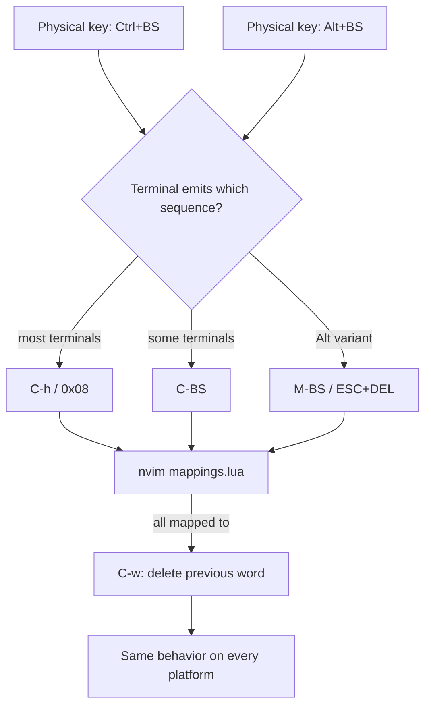

# 跨平台按鍵統一：讓 Ctrl/Alt+Backspace 在各平台行為一致

## WHY — 為什麼需要這件事？

先想一個情境：你在 Windows 上習慣按 `Ctrl+Backspace` 一次刪掉一整個詞（word-wise delete），這是 Windows 各種輸入框的慣例。但當你切到 Linux 桌面、或透過 SSH 連到遠端機器時，同樣的肌肉記憶卻沒反應；Linux 桌面的慣用鍵反而是 `Alt+Backspace`。

於是出現一個很實際的痛點：

> 同一個「刪掉前一個詞」的動作，為什麼在不同平台要按不同鍵、有時甚至完全沒反應？

如果你每天在 Windows 與 Linux（或本機與遠端）之間切換，這種「按鍵行為漂移」會不斷打斷編輯節奏。我們的目標很單純：**統一成 Linux 習慣的行為 —— 不論在哪個平台、按 `Ctrl+Backspace` 或 `Alt+Backspace`，都一律「往回刪一個詞」。**

並且要回答一個核心問題：**這件事有沒有辦法從 nvim 這一層統一掉？**

結論先講：**可以。** 下面我們從原理講到具體實作。

## HOW — 原理：為什麼按鍵會「漂移」？

### 蘇格拉底式提問：nvim 到底「看到」了什麼？

要理解為什麼行為會漂移，先問自己一個問題：

> 當我按下 `Ctrl+Backspace`，nvim 真的收到「Ctrl+Backspace」這個概念嗎？

答案是：**通常沒有。** nvim 在終端機裡跑時，它收到的不是「按鍵」這個抽象概念，而是終端機送進來的一串**位元組序列（byte sequence）**。問題就出在這裡 —— 同一個實體按鍵，不同的終端機會送出不同的位元組。

具體來說：

- **Backspace 本身**：很多終端機送的是 `0x7F`（DEL）。
- **Ctrl+Backspace**：因為 Backspace 已經佔用了 `0x7F`，Ctrl 版常常「退化」成 `0x08`，也就是 nvim 眼中的 `<C-h>`。只有少數終端機會送出真正、獨立可辨識的 `<C-BS>`。
- **Alt+Backspace**：通常送出 `<M-BS>`，也就是 `ESC` 前綴加上 `DEL`。

換句話說，**「Ctrl+Backspace」這個實體動作，在 nvim 眼裡可能變成三種不同的東西**：`<C-h>`、`<C-BS>`、或 `<M-BS>`（後者來自 Alt 版）。這就是為什麼同一個動作在不同平台/終端機要按不同鍵、甚至沒反應的根本原因。

### 對策：把所有變體都對到同一個動作

既然問題是「一個動作被拆成多種序列」，那解法就反過來：**把所有可能的序列，全部對應到同一個動作。**

vim 在 insert mode 內建一個指令 `<C-w>`，意思就是「往回刪一個詞」。所以我們的策略是：把 `<C-BS>`、`<C-h>`、`<M-BS>` 這三個變體，全部 map 到 `<C-w>`。

這樣一來，不論本機是什麼 OS、不論用哪個終端機，只要它送出的序列落在這三種之一，nvim 就會統一執行「往回刪一個詞」。



整個流程的核心觀念是：**我們無法控制終端機送出哪一種序列，但我們可以在 nvim 這層把所有已知變體「收斂」到同一個動作。**

## WHAT — 具體實作與設定

### 已實作的 mapping

設定寫在 `lua/mappings.lua`。邏輯是用一個迴圈，把三個按鍵變體在 **insert mode** 與 **cmdline mode** 都 map 到 `<C-w>`：

```lua
for _, key in ipairs { "<C-BS>", "<C-h>", "<M-BS>" } do
  vim.keymap.set({ "i", "c" }, key, "<C-w>")
end
```

重點拆解：

| 項目 | 內容 | 說明 |
|------|------|------|
| 涵蓋的按鍵變體 | `<C-BS>`、`<C-h>`、`<M-BS>` | 把 Ctrl+Backspace 的各種退化形式，以及 Alt+Backspace，全部納入 |
| 涵蓋的模式 | insert（`i`）、cmdline（`c`） | 打字編輯與命令列輸入都統一行為 |
| 統一動作 | `<C-w>` | vim insert mode 內建的「刪前一個詞」 |
| 統一後的習慣 | Linux 風格 | Ctrl+Backspace 與 Alt+Backspace 都等於「往回刪一個詞」 |

### 如何驗證

有兩種方式可以確認設定生效：

**方式一：直接操作驗證**

1. 開啟 nvim，進入 insert mode（按 `i`）。
2. 隨手打一句有多個詞的文字，例如 `hello world foo`。
3. 把游標停在最後，按 `Ctrl+Backspace`（或 `Alt+Backspace`）。
4. 預期結果：**一次刪掉一整個詞**（例如 `foo` 整段消失），而不是只刪一個字元。

**方式二：用 nvim 內建指令檢查 mapping**

在 normal mode 下執行：

```vim
:verbose imap <C-h>
```

可以看到 `<C-h>` 在 insert mode 被 map 到什麼。實測上，這三個鍵（`<C-BS>`、`<C-h>`、`<M-BS>`）在 insert mode 用 `maparg` 查詢都會顯示對到 `<C-W>`，代表收斂成功。

### 誠實的限制說明

這個方法很可靠，但有一個前提需要坦白講清楚：

> 如果終端機**根本沒送出任何可辨識的序列**怎麼辦？

舉例來說，某些終端機會把 `Ctrl+Backspace` 完全當成一般的 `Backspace`（送一樣的位元組）。這種情況下，nvim 收到的根本是 Backspace，沒有任何資訊可以區分，自然也就無法把它導向 `<C-w>` —— 不是我們的 mapping 失效，而是「資訊在進到 nvim 之前就已經丟失了」。

解法是從終端機那一層補上資訊：許多現代終端機支援 **CSI u**（也就是 `modifyOtherKeys` / CSI u 模式）。開啟後，終端機會為 `Ctrl+Backspace` 送出一段獨立、可辨識的序列，nvim 就能收到真正的 `<C-BS>`，我們的 mapping 也就能正常接手。

另外補充一個好消息：**GUI 版（如 Neovide）沒有這個問題**。因為 GUI 不經過終端機的位元組轉換，按鍵資訊是直接傳給 nvim 的，所以 `<C-BS>` / `<M-BS>` 本來就能被正確辨識。

---

## 延伸閱讀

- [剪貼簿與 OSC52 指南](./CLIPBOARD_OSC52_GUIDE.md) —— 另一個「終端機這層會影響 nvim 行為」的經典題目：為什麼遠端 yank 到不了本機剪貼簿，以及如何用 OSC52 解決。
