# Telescope 報 "'ripgrep' is a required dependency" — rg/fd 上 PATH

> 故障排除實錄。發生日期：2026-06-16
> 相關文件：[MARKDOWN_PREVIEW_NODE_SETUP.md](./MARKDOWN_PREVIEW_NODE_SETUP.md)、[TREESITTER_CYGWIN_CRASH.md](./TREESITTER_CYGWIN_CRASH.md)、[MSYS2_SETUP_GUIDE.md](./MSYS2_SETUP_GUIDE.md)、[TELESCOPE_GITIGNORE_CONFIG.md](./TELESCOPE_GITIGNORE_CONFIG.md)

## 一、症狀

開啟 Telescope 的 `live_grep`（預設快捷 `<leader>fw`）時報錯：

```
[telescope.live_grep]: 'ripgrep', or similar alternative, is a required dependency for the
live_grep picker. Visit https://github.com/BurntSushi/ripgrep#installation for installation
instructions.
```

`find_files` 不會報錯（會悄悄退回 Telescope 內建 `find`，只是較慢、不尊重 `.gitignore`）。

## 二、根因

**這不是「沒裝 ripgrep」，而是「nvim 繼承到的 PATH 看不到 ripgrep」。** 與 markdown-preview 找不到
node、treesitter 找不到原生編譯器是**同一類問題的第三個實例**：工具二進位確實在硬碟上，但
Neovim（原生 Windows 程序）啟動時繼承的 PATH 並不包含它所在的目錄。

本機實測（已驗證）：

| 檢查 | 結果 |
|------|------|
| `rg.exe` 是否存在於硬碟 | **是** — `%LOCALAPPDATA%\Microsoft\WinGet\Links\rg.exe`（winget 裝的 `BurntSushi.ripgrep.MSVC`） |
| 該 shim 目錄是否在 nvim 的 PATH | **否** — `executable('rg') == 0` |
| 把該目錄 prepend 進 PATH 後 | `executable('rg') == 1` ✅ |

為何 winget 的 shim 目錄不在 PATH？常見成因：

- **winget Links 是 per-user 的 symlink 目錄**（`Links\rg.exe` 是指向 `Packages\...\rg.exe` 的符號連結）。
  它要靠 winget 在安裝時把 `%LOCALAPPDATA%\Microsoft\WinGet\Links` 寫進 User PATH，但若安裝後沒有
  重開 session、或 nvim 從一個 PATH 尚未刷新的父行程（舊終端、服務、SSH）被啟動，就看不到。
- **SSH / session 隔離**：非登入 shell 的 PATH 精簡，桌面環境的 User PATH 不一定被繼承。
- **symlink 在 Developer Mode 關閉或權限受限時無法跟隨** → 即使目錄在 PATH，shim 也可能解析失敗。

```mermaid
flowchart TD
    A[Telescope live_grep] --> B{executable&#40;'rg'&#41;?}
    B -- 1 --> C[正常 grep]
    B -- 0 --> D[報錯：ripgrep is required]
    E[rg.exe 在 WinGet/Links] -. 但該目錄不在 nvim PATH .-> B
```



## 三、解法（已完成）：把 rg/fd 探索納入 bootstrap

核心理念與 node/編譯器一致：**不是叫使用者改系統 PATH，而是讓 nvim 啟動時自己把工具目錄補進
`vim.env.PATH`**。這樣機群裡任何一台機器，只要用任一常見方式裝過 rg/fd，nvim 就自動找得到。

在 [`lua/configs/bootstrap.lua`](../lua/configs/bootstrap.lua) 新增第三個資料驅動模組
`setup_search_tools()`，結構鏡像既有的 `setup_node()`：

1. `search_roots()` — 有序候選根表（全部從環境變數 + glob 推導，**零寫死**使用者名/磁碟/版本）。
2. `discover_tool(names, roots)` —
   - **step 1（全平台短路）**：`vim.fn.executable(name)` 已找得到就直接用 `exepath`，純 no-op 不 glob
     （一般 Linux 與「桌面已設定好」的常見路徑）。
   - **step 2**：依候選根 + 每工具 glob 樣板尋找，**第一個可用命中即勝**（任一 rg/fd 都行，無需版本排序）。
3. `setup_search_tools()` — 對 rg、fd 各解析一次，把所在目錄 `prepend_path`（已內建大小寫去重 →
   同目錄只加一次、可重複呼叫不重複加）。回傳 `{ rg=..., fd=... }` 供診斷。
4. 在 `M.setup()` 以**獨立 `pcall`** 接入，與 cc/node 並列 — 任何例外都被吞掉，**永遠不會中斷 nvim 啟動**；
   最壞情況只是 Telescope 維持原本的 "ripgrep is required" 訊息，而不是崩潰。

### 與 node/編譯器模組的關鍵差異

| 面向 | 編譯器（cc） | 搜尋工具（rg/fd） |
|------|------|------|
| 是否需 `-dumpmachine` | **是**（要排除 cygwin/msys gcc，否則 parser 崩潰） | **否** — rg/fd 是靜態原生 PE，絕不會是 cygwin 子系統 |
| 是否需「最新版勝」排序 | node 需要 | **否** — 任一可用的 rg/fd 都行，第一個命中即勝（最快） |
| junction 處理 | — | 偏好扁平 Links/shims 目錄；直接 glob 真實巢狀 Packages 版本目錄，**不穿越 `current` junction** |

### 安裝方式 → 候選根對照（機群可攜）

任一方式裝過，nvim 即自動發現：

| 安裝方式（README / docs 文件） | 命中的候選根 |
|------|------|
| `winget install BurntSushi.ripgrep.MSVC` / `winget install sharkdp.fd` | `WinGet\Links`（user/machine）+ `WinGet\Packages\*ripgrep*\*\rg.exe`（symlink 失敗時的 fallback） |
| `pacman -S mingw-w64-ucrt-x86_64-{ripgrep,fd}`（見 MSYS2_SETUP_GUIDE.md） | `<msys>\ucrt64\bin`、`clang64\bin`、`mingw64\bin` |
| `scoop install ripgrep` / `scoop install fd` | scoop user/global 的 `shims\` |
| `choco install ripgrep` / `choco install fd` | choco `bin\` 與 `lib\<pkg>\tools\` |
| `cargo install ripgrep` / `cargo install fd-find` | `$CARGO_HOME\bin`（預設 `~\.cargo\bin`） |
| `uv tool` / `pipx` / `cargo-binstall` / 手動解壓 | `~\.local\bin` |
| apt / brew / snap（Linux / Jetson） | `/usr`、`/usr/local`、`/opt/homebrew`、linuxbrew、`/snap`（且 fd 在 Debian 系改名 `fdfind`，已多試此名） |

## 四、順帶修正：`image_preview.lua` 的寫死路徑

[`lua/configs/image_preview.lua`](../lua/configs/image_preview.lua) 原本寫死
`C:\msys64_2\ucrt64\bin\{fd,chafa}.exe`（本機實測：`C:\msys64_2` 根本不存在，是死路徑，違反零寫死哲學）。
已改為從 PATH 解析的 `tool(name)`（`executable` → `exepath`，找不到才退回裸名）。fd 所在目錄現由
`setup_search_tools()` 統一補進 PATH，圖片瀏覽器與 Telescope 共用同一套發現機制。

## 五、已知前提（不誇大）

- **本機目前沒有安裝 fd**（winget/scoop/cargo/choco/msys 都查無）。修好後 `fd` 解析為 nil → 靜默降級，
  `find_files` 維持 Telescope 內建 `find` fallback（功能可用、較慢）。圖片瀏覽器在裝 fd 之前無法啟動，
  這是**正確的靜默降級，不是回歸**。需要時裝：`winget install sharkdp.fd` 或
  `pacman -S mingw-w64-ucrt-x86_64-fd`。
- **chafa（圖片預覽渲染）不在 `setup_search_tools()` 範圍內**（該模組只負責 rg/fd），本機亦未安裝，
  `chafa_path` 維持裸名 `chafa`，預覽器在 chafa 上 PATH 之前不會渲染。本次修正仍**移除了 chafa 的死路徑**
  （死的寫死路徑本身就是零寫死規範的違反）。

## 六、驗證（headless，從乾淨 PATH）

```powershell
# 移除 winget Links / scoop shims，模擬 nvim 繼承不到 rg 的真實情境
$env:PATH = ($env:PATH -split ';' | Where-Object { $_ -notlike '*WinGet*' -and $_ -notlike '*scoop*shims*' }) -join ';'

# setup 前：應為 0
nvim --headless --clean "+lua io.write('rg='..vim.fn.executable('rg'))" +q

# setup 後：應為 1，且 summary.search.rg 指向 Links\rg.exe；cc/node 不回歸
nvim --headless "+lua local s=require('configs.bootstrap').setup(); io.write('rg='..vim.fn.executable('rg')..' search='..tostring(s.search.rg)..' cc='..tostring(s.cc))" +q
```

實測結果：

```
setup 前：rg=0
setup 後：rg=1   search=C:/Users/.../WinGet/Links/rg.EXE   cc=C:/msys64/ucrt64/bin/gcc.exe（無回歸）
完整啟動：LIVEGREP_RG_AVAILABLE=1   telescope_loaded=true   startup_errors=no
```
