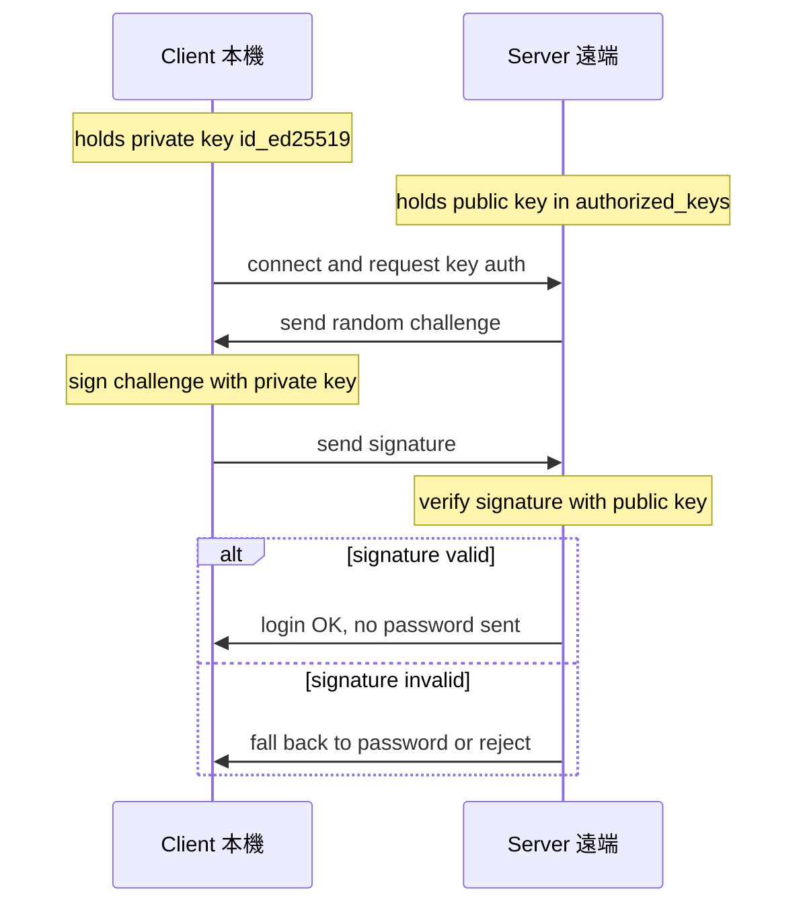
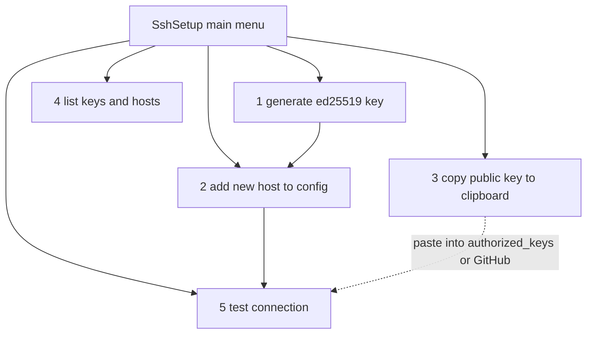

# SSH 配置黃金圈 + 內建設定精靈（小白也能用）

> 這份文件用「黃金圈（Why → How → What）」帶你理解 SSH 金鑰登入，並介紹本 repo 在 Neovim 裡新增的 **SSH 設定精靈**：不用先記住一堆參數，全程問答就能完成設定。
>
> 細節級的 client/server/疑難排解請看既有完整參考：[`docs/ssh-key-login-guide.md`](./ssh-key-login-guide.md)。本文不重抄，只講「重點」與「精靈用法」。

---

## WHY — 為什麼要放棄密碼登入？

先問一個問題：**每天 `ssh user@server` 都要輸入一次密碼，到底哪裡不好？**

不只是「煩」而已，密碼登入有三個結構性痛點：

1. **可被暴力破解 / 字典攻擊**：只要對外開 22 port，全世界的掃描機器人都會不停試你的密碼。密碼再長，也只是「拖延時間」。
2. **密碼會被傳輸與重用**：人類傾向在多台機器用同一組密碼，一台被攻破等於全部淪陷。
3. **無法自動化**：腳本、CI、`scp`、`rsync`、Git 推送都需要免互動登入，密碼擋住了一切自動化。

再追問：**那有沒有一種方式，登入時根本不用「把祕密送出去」？**

有——這就是 **SSH 金鑰登入（非對稱加密）**。它的核心承諾是：

> 證明「我持有私鑰」，但**私鑰永遠不離開本機**，也**不傳密碼**。

---

## HOW — 非對稱加密握手的原理

### 兩把鑰匙，各司其職

非對稱加密會產生一對鑰匙：

| 鑰匙 | 檔名（ed25519） | 放哪裡 | 性質 |
|------|------------------|--------|------|
| **私鑰** | `id_ed25519` | **只留本機，絕不外流** | 用來「簽名」，證明身分 |
| **公鑰** | `id_ed25519.pub` | 複製到遠端的 `authorized_keys` | 用來「驗證」簽名 |

關鍵直覺：**公鑰可以隨便給人**（貼到 GitHub、貼到對方 `authorized_keys` 都沒關係），但**私鑰一旦外流就等於把家裡鑰匙交出去**。

### 登入時到底發生什麼事？

蘇格拉底式提問：**遠端伺服器既然從不收到密碼，它怎麼知道「來的人是真的」？**

答案是「挑戰—回應（challenge-response）」：伺服器丟一個隨機難題，只有「持有對應私鑰的人」才簽得出正確答案；伺服器再用它手上的公鑰去驗證那個簽名。整個過程私鑰只在本機運算，不會被送出。



### 演算法怎麼選？

| 演算法 | 建議 | 說明 |
|--------|------|------|
| **ed25519** | ✅ 首選 | 現代、金鑰短、運算快、安全性高 |
| rsa | ⚠️ 相容用 | 較舊，要用就 `-b 4096`，金鑰長 |
| dsa | ❌ 禁用 | 已過時不安全 |

### `~/.ssh` 裡有什麼？

```
~/.ssh/
├── config          # 連線別名與「哪台用哪把金鑰」
├── id_ed25519      # 私鑰（權限要嚴格）
├── id_ed25519.pub  # 公鑰（可外流）
└── known_hosts     # 記住連過的伺服器指紋
```

### 多台設備怎麼管？

這裡的原則只有一句話：**讓「洩漏的爆炸半徑」最小。**

- **每台設備一把金鑰**：某把私鑰洩漏，只影響那一台，撤銷成本最低。
- **多台電腦要登入同一台伺服器**：在伺服器的 `authorized_keys` 放上**多把公鑰**（一行一把）。
- **撤銷某台的存取**：到伺服器 `authorized_keys` **刪掉那一行**即可。

---

## WHAT — 具體操作

下面分兩條路：**(A) 用 Neovim 內建精靈（推薦小白）**，與 **(B) 你該認識的 `~/.ssh/config` 範例**。

### (A) Neovim 內建 SSH 設定精靈

本 repo 新增 [`lua/configs/ssh_tui.lua`](../lua/configs/ssh_tui.lua)（已驗證載入），讓你**不用記任何參數**，全程問答即可。

**入口（擇一）：**

- 指令：`:SshSetup`
- 快捷鍵：`<leader>Sk`

跳出 `vim.ui.select` 主選單，五個選項對應「完整設定一台主機」的五個步驟：



**五項說明：**

1. **產生新金鑰**：用 `ed25519`，會問「用途標籤」與檔名（預設 `id_ed25519`），並以 `-N ""` 不設 passphrase（最無痛）。
2. **設定一台新主機**：問「別名 / IP / 帳號 / Port」，寫進 `~/.ssh/config` 的 `Host` 別名，接著協助把公鑰部署到對方。
3. **複製某把公鑰到系統剪貼簿**：方便你直接貼進對方 `authorized_keys`、或貼到 GitHub / GitLab。
4. **列出現有金鑰與已設定主機**：一眼看清楚目前有哪些金鑰、設過哪些 Host。
5. **測試連線**：用 `ssh -o BatchMode=yes` 驗證是否「真的免密碼」成功（`BatchMode` 會禁用互動式詢問，所以一旦還需要打密碼就會直接失敗，幫你確認金鑰是否真的生效）。

**部署公鑰的兩種情況（精靈會自動判斷）：**

- **有 `ssh-copy-id`（Linux / macOS 常見）**：精靈提示你用它，一行搞定。
- **沒有 `ssh-copy-id`（Windows client 常見）**：精靈給你一段「在遠端執行」的 shell 指令，讓你開一個新終端貼上跑。它會問你**一次**密碼（這是最後一次）：

  ```sh
  umask 077; mkdir -p ~/.ssh && echo "你的公鑰內容" >> ~/.ssh/authorized_keys
  ```

  `umask 077` 確保 `~/.ssh` 與 `authorized_keys` 權限夠嚴格——這點在 Windows server 尤其重要（見下方警告）。

**跨平台說明**：精靈對 `~/.ssh` 路徑、檔案讀寫、外部指令全部走 Neovim API（`vim.fn.expand` / `has('win32')` / `vim.system`），所以 **Windows 與 Linux 共用同一套流程**。

> ⚠️ **Windows server 的隱形坑**：Windows 上 `authorized_keys` 的 ACL 權限非常嚴格。一旦權限設錯，伺服器會**靜默拒絕**這把金鑰，結果**看起來像「密碼錯誤」**（其實是金鑰被忽略了）。Windows server 端需要用 `icacls` 修正權限——詳細步驟請看 [`docs/ssh-key-login-guide.md`](./ssh-key-login-guide.md)。

### (B) `~/.ssh/config` 範例（精靈會幫你寫，但你該看懂）

精靈幫你寫進去的，本質上就是這種內容。看懂它，將來手動微調也不怕：

```ssh-config
# 一個主機別名：之後只要 `ssh myserver` 即可
Host myserver
    HostName 192.168.1.100
    User alice
    Port 22
    IdentityFile ~/.ssh/id_ed25519
    IdentitiesOnly yes     # 只用指定的這把金鑰，不要把 agent 裡所有金鑰都丟出去試
    AddKeysToAgent yes     # 用過自動加進 ssh-agent

# 對所有主機生效的共用設定
Host *
    ServerAliveInterval 60 # 每 60 秒送一次保活封包，避免閒置被斷線
```

幾個建議選項的「為什麼」：

- **`IdentitiesOnly yes`**：避免 ssh-agent 把每把金鑰都拿去試（試太多次可能先觸發伺服器的失敗上限而被拒）。
- **`AddKeysToAgent yes`** 搭配 **`ssh-agent`**：金鑰用過就快取，**避免每次都要輸入 passphrase**（若你選擇有設 passphrase 的話）。
- **`ServerAliveInterval 60`**：長時間掛著 SSH session（例如跑遠端編輯）不會因閒置被中間設備斷線。

---

## 快速回顧（TL;DR）

- **WHY**：密碼會被爆破、會被重用、擋住自動化；金鑰登入「不送祕密、私鑰不外流」。
- **HOW**：非對稱加密 + 挑戰回應；client 用**私鑰簽**、server 用 `authorized_keys` 裡的**公鑰驗**；演算法選 **ed25519**。
- **WHAT**：在 Neovim 裡 `:SshSetup`（或 `<leader>Sk`）→ 產金鑰 → 設主機 → 部署公鑰 → 測試連線，五步完成；`~/.ssh/config` 用 `Host` 別名管理多台。

---

## 延伸閱讀

- 完整 client / server / 疑難排解指南：[`docs/ssh-key-login-guide.md`](./ssh-key-login-guide.md)
- 精靈實作原始碼：[`lua/configs/ssh_tui.lua`](../lua/configs/ssh_tui.lua)
