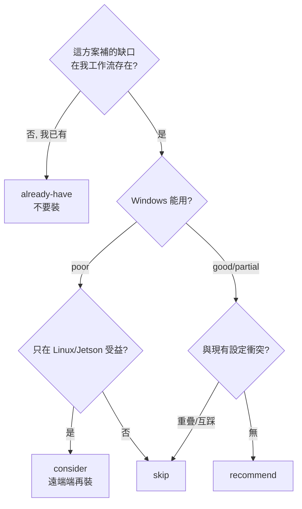
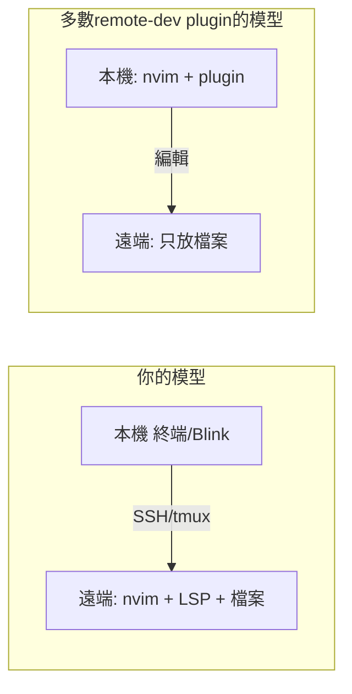
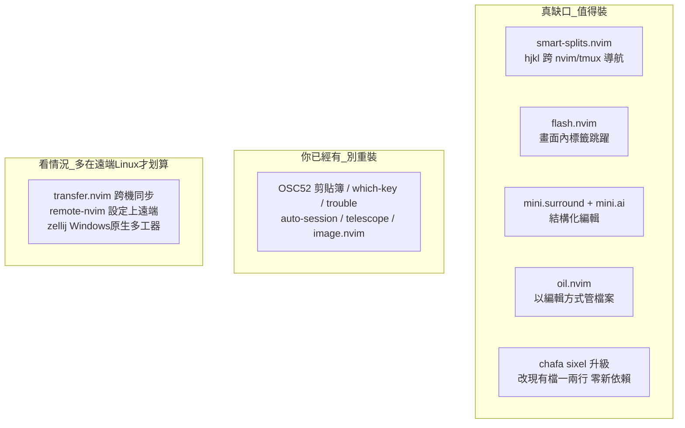

# 終端編程互動性：現成方案盤點（別重造輪子）

> 這份文件不改任何 code，是一份「採購清單」。把「讓 tmux + nvim 終端編程互動性更強」這件事，
> 拆成四個方向，盤點 2026 年仍在維護的現成 plugin / 工具，並**對照你現有設定**逐一判定：
> 該裝（recommend）／可考慮（consider）／略過（skip）／你已經有了（already-have）。
> 你看完自己決定要不要裝，能省則省、不重造輪子。

---

## WHY — 為什麼是「盤點」而不是「開發」？

你已經自己寫了不少互動性功能（OSC52 剪貼簿、filebrowser web-media、chafa 圖片預覽、SSH 精靈、
buffer 顯示名、tab-local 專案根…）。再往下走，**很多你想要的東西社群早就有成熟解了**——
與其再寫一份，不如先確認「哪些缺口真的還沒補、哪些其實已經有、哪些裝了會跟現有設定打架」。

蘇格拉底式先問三個問題，貫穿全文：

1. **這個方案補的「缺口」，在我的工作流裡真的存在嗎？**（很多 remote-dev plugin 解的是「本機 nvim 編輯遠端檔」，但你的模型是「nvim 直接跑在遠端」——方向相反，缺口根本不存在。）
2. **它在 Windows 能用嗎？**（你主場是 Windows 原生 + MSYS2 + SSH/iPad Blink，很多方案預設 Linux。）
3. **它會不會跟我已經有的東西重疊 / 互踩？**（例如剪貼簿同步類 plugin 會和你的 OSC52 互相覆蓋。）

---

## HOW — 判定的座標系：你現有設定 vs 候選方案

你現有、與本主題相關的設定（判定的基準線）：

| 已有 | 檔案 | 它已經解決了什麼 |
|------|------|------------------|
| OSC52 剪貼簿 | `lua/configs/clipboard.lua` | SSH 下 yank 到本機剪貼簿、`<leader>Y` 整檔複製 |
| web-media | `lua/configs/web_media.lua` | 瀏覽器看完整多媒體（影片/PDF/手機可看） |
| 圖片預覽 | `lua/configs/image_preview.lua` | 終端內 chafa ASCII 翻圖（跨平台含 Windows/SSH） |
| image.nvim | `lua/plugins/init.lua`（`cond` 非 win32） | Linux/Jetson 的 inline 真彩圖 |
| SSH 精靈 | `lua/configs/ssh_tui.lua` | 產金鑰/寫 config/部署公鑰/測連線 |
| session/專案 | auto-session + project.nvim + `:tcd` | nvim 層 session 還原、tab-local 專案根 |
| 搜尋/檔案 | telescope（+live_grep_args）、nvim-tree | 模糊搜尋、檔案樹 |
| UI 提示/面板 | NvChad 內建 which-key、trouble | 按鍵提示、diagnostics 面板 |

> 一個跨方向的大前提：**tmux 在 Windows 沒有原生 port**，你是靠 MSYS2 ucrt64 跑 tmux。
> 所以所有「tmux pane 整合」類方案，在 Windows 只在 MSYS2 的 tmux session 內生效；
> Windows 純 nvim（沒開 tmux）時會退化成只在 nvim 內作用。

---

## WHAT — 四個方向的盤點結果

### 方向一：tmux + nvim 整合

**最關鍵發現**：掃過你整份設定，**normal 模式沒有任何 `<C-h/j/k/l>` 視窗導航或 split resize 綁定**
（那幾個鍵只在 insert/cmdline 被你對到 `<C-w>` 刪詞）。所以「用同一組 hjkl 在 nvim split 與 tmux pane
之間無縫移動」是你真正的缺口。

| 方案 | 判定 | 重點 |
|------|------|------|
| **smart-splits.nvim**（mrjones2014） | ✅ **recommend** | 同一組 `<C-h/j/k/l>` 跨 nvim split ↔ tmux pane 移動 + 跨界 resize；支援 tmux/wezterm/kitty/zellij，自動偵測。純 nvim（無 tmux）也能用，退化成單純 split 導航。**唯一強推**。維護活躍但 2026 有搬離 GitHub 的討論，裝前確認 repo 位置。 |
| vim-tmux-navigator（christoomey） | 🤔 consider | 元祖、穩定，但只導航不 resize、只支援 tmux。是 smart-splits 的陽春替代，**三選一**。 |
| nvim-tmux-navigation（alexghergh） | ⏭ skip | 純 Lua 重寫，功能比 smart-splits 窄。同樣搶 `<C-h/j/k/l>`，已選 smart-splits 就不需要。 |
| tmux.nvim 的 copy-sync（aserowy） | ⏭ skip | 導航重疊；獨特的 copy-sync 與你 OSC52 **重疊且可能互踩**（兩者都動 register / `vim.g.clipboard`）。作者已進維護模式。 |
| sesh（joshmedeski） | 🤔 consider | tmux session 快速跳專案（zoxide+fzf）。與 auto-session 不同層；Windows-native 弱，主要在遠端 Linux 受益。 |
| tmux-resurrect / continuum | 🤔 consider | tmux 層 session 持久化（重開機還原佈局）。與 nvim 的 auto-session 概念重疊、不同層；Windows 僅 MSYS2。 |
| zellij | 🤔 consider | **tmux 的替代品**（非 plugin）。0.44 起原生支援 Windows——這是它對你最大的意義。但換掉 tmux 屬大改動，牽動剪貼簿/session 既有設定。 |

> **最小衝突路徑**：只裝 `smart-splits.nvim`，nvim 端綁 `<C-h/j/k/l>` 導航；resize 鍵別用 `<A-h>`
> （已被 NvChad 水平 terminal 佔用）。tmux.conf 要加 `@pane-is-vim` 判斷段。剪貼簿與 session **都不要動**。

---

### 方向二：SSH / 遠端開發體驗

**最關鍵判斷**：你的模型是「**nvim 跑在遠端、人在本機透過 SSH/tmux/iPad Blink 連進去**」。
市面上絕大多數 remote-dev plugin（distant.nvim、remote-ssh.nvim、remote-sshfs.nvim、oil-ssh、netman）
解的是**相反方向**——「本機 nvim 編輯遠端檔」。方向對不上時，它們號稱補的缺口在你的模型裡早已內建
（遠端檔=本地檔、LSP 本來就在遠端跑），所以大多 skip。

| 方案 | 判定 | 重點 |
|------|------|------|
| nvim-osc52（ojroques） | ✅ already-have | 作者自己標 obsolete（Neovim 0.10 起內建 OSC52）。你的 `clipboard.lua` 更完整。**不要裝**。 |
| transfer.nvim（coffebar） | 🤔 consider | rsync 跨機同步（手動 + 可選存檔即同步 + dir-diff）。**這是你唯一還沒被 nvim 整合的格子**（你現在手動 rsync）。但 README 明列 Windows 路徑不支援，主要在 Linux/Jetson 端受益。 |
| remote-nvim.nvim（amitds1997） | 🤔 consider | 一鍵把你這套 NvChad 設定同步到任一遠端、在遠端跑同一份 config。**唯一在「改變工作流」前提下值得認真評估的**；但 headless server+TUI 在 iPad Blink 多跳鏈路延遲體感可能比純 tmux+nvim 差，自承未成熟。先在一台 Linux 遠端試水。 |
| rsync.nvim / vim-arsync | ⏭ skip | 同步格子；存檔自動 rsync。Windows-as-client 踩路徑與 build 坑（rsync.nvim 要 build Rust）。 |
| oil.nvim 的 ssh:// | ⏭ skip（遠端用途） | ssh adapter **不支援 Windows 當遠端**，遠端需 `/bin/sh`。你遠端常是 Windows → 不通。（oil 本機用途見方向四。） |
| distant.nvim / remote-ssh.nvim / remote-sshfs.nvim / netman.nvim | ⏭ skip | 全是「本機編輯遠端」模型，方向不符；且各有 Windows/依賴/維護放緩問題。 |

> **務實結論**：遠端剪貼簿、金鑰連線、看媒體、檔案搜尋、遠端 LSP——**你全都已經有了**。
> 唯一真缺口是「跨機專案同步」，但 Windows-as-client 的 plugin 都不理想。
> 建議：同步若多在 Linux/Jetson 端 → 試 `transfer.nvim`；若堅持 Windows 端 → 繼續用你 MSYS2 的 rsync，
> 或自己包一個薄 nvim command 呼叫 rsync（沿用 `web_media.lua` 那種 `vim.system` 風格，最不踩坑）。

---

### 方向三：多媒體 / 預覽體驗

**最關鍵判斷**：你現有的「chafa（終端 ASCII 快翻）+ filebrowser（瀏覽器看完整多媒體）+
image.nvim（僅非 win32）」在 2026 **仍然是針對你異質環境最務實的選擇，不是落伍**。
因為所有 inline terminal-graphics 方案本質都依賴 kitty graphics 或 sixel，而這兩者在你的主場
（MSYS2 mintty、Windows conhost/Terminal、SSH 過 tmux）都還沒可靠落地。

| 方案 | 判定 | 重點 |
|------|------|------|
| **chafa sixel 升級**（改 `image_preview.lua` 一兩行，零新依賴） | ✅ **recommend** | 你現在把 chafa 寫死 `-f symbols`（純 ASCII）。chafa 1.8+ 能自動偵測終端能力輸出 sixel/kitty 真彩圖，不支援的自動退回 ASCII。把 `-f symbols` 改成自動偵測，在支援 sixel 的終端（多半是 SSH 到 Linux 端 / WezTerm）就升級成真彩，純文字終端零影響。**CP 值最高**。建議加切換開關並實測 Telescope previewer 殘影。 |
| snacks.nvim 的 image 模組（folke） | 🤔 consider | inline-in-buffer + markdown 內嵌圖（kitty protocol）。極活躍。但 Windows 上 inline 被停用、只剩 floating window，且要換 WezTerm + 裝 ImageMagick。Linux/Jetson 端才值得，且只開 image 子模組。 |
| 3rd/image.nvim | ✅ already-have | 就是你現有依賴本身，已正確地用 `cond` 在 win32 關閉。維持現狀即正解。 |
| hologram.nvim | ⏭ skip | 被 image.nvim 取代且更弱、Windows 不支援、原版停滯。 |
| WezTerm / Ghostty（Windows） | ⏭ skip | 為了 inline 圖換終端、且 Windows 版受 ConPTY 限制多有 workaround，投報率低。官方 Ghostty 無 Windows。 |

> **誠實標註**：「sixel 在 Windows 能不能顯示」需要你在實際終端實測——mintty 對 sixel 支援歷來有限，
> 很可能 Windows 原生仍只看到 ASCII。這恰好再次印證 **filebrowser 這條 web 路線在 Windows 不可取代**。

---

### 方向四：編輯器互動性本身（不用背快捷鍵）

**最關鍵判斷**：這個方向你「已經有」的比想像多——NvChad 核心已內建 which-key、你也裝了 trouble。
真正能補缺口的是「**畫面內移動**」與「**結構化編輯動作**」，而不是再疊一層 UI 框架。

| 方案 | 判定 | 重點 |
|------|------|------|
| **flash.nvim**（folke） | ✅ **recommend** | 標籤式跳躍：搜尋/jump 時把畫面所有匹配點標字母，一鍵跳過去；Treesitter 模式一鍵選整個語法節點。補「同 buffer 內視線可及處瞬間移動」缺口，零記憶負擔，跨平台，不碰 telescope/tree/剪貼簿。NvChad 未內建。 |
| **mini.surround + mini.ai**（nvim-mini） | ✅ **recommend** | 只取需要的模組：surround（`sa/sd/sr` 加/刪/換包圍符）、ai（更強且可 Treesitter 化的 text-object，如 `cif` 改整個函式內）。補「結構化編輯」缺口，足跡極小，極活躍。**注意 org 已遷到 `nvim-mini/mini.nvim`**。 |
| **oil.nvim**（stevearc，本機用途） | ✅ **recommend** | 把目錄當 buffer 編輯：用 `dd/p/:w` 改名/搬移/批次整理檔案，記憶負擔=平常的編輯鍵。與 nvim-tree **互補**（tree 看結構、oil 做操作），可並存。Windows 本機目錄操作正常（ssh 遠端到 Windows 不行，見方向二）。 |
| which-key.nvim | ✅ already-have | **NvChad 核心已內建並設定好**，你所有 keymap 的 `desc` 已自動進提示面板。再自行加 spec 會與 base46 整合打架。 |
| trouble.nvim | ✅ already-have | 你 `plugins/init.lua` 已裝、綁好 `<leader>x` 系列。 |
| mini.clue | ⏭ skip | 與已內建的 which-key 重複。 |
| snacks.nvim（整包） | 🤔 consider | picker/explorer/dashboard/notifier/input 全與你的 telescope/nvim-tree/nvdash/自寫 `vim.ui.input` 流程**強烈重疊且會接管**。若要用，只開單一模組（zen/words/scope），其餘 `enabled=false`。 |
| mini.pairs / mini.pick / mini.files / mini.starter | ⏭ skip | 分別與 nvim-autopairs / telescope / nvim-tree / nvdash 重疊。 |

> ⚠️ **唯一要事先協調的鍵位**：`flash.nvim` 與 `mini.surround` 預設**都想用 `s`**。兩者都裝必須擇一改鍵
> （例如 flash 用 `s`、mini.surround 改非 `s` 前綴，或反之）。

---

## 一頁總結：如果只看一行

- **最高 CP 值、最該先試**：`smart-splits.nvim`（補真缺口）+ chafa sixel 升級（零新依賴、改你現有檔）。
- **降低記憶負擔三件套**：`flash.nvim` + `mini.surround`/`mini.ai` + `oil.nvim`（注意 flash 與 mini.surround 的 `s` 鍵衝突）。
- **別重造也別重裝**：剪貼簿、which-key、trouble、session、搜尋、看媒體——你都已經有了。
- **跨機同步**是你唯一還沒整合進 nvim 的格子，但 Windows-as-client 的 plugin 都不理想，建議續用 MSYS2 rsync 或包薄 command。

> 所有維護現況 / star 數 / 日期為 2026-06 查證當下的線索，標「需再確認」者請裝前再確認一次
> （尤其 smart-splits 有搬離 GitHub 的討論、mini.nvim 已遷到 `nvim-mini` org）。

---

## 延伸閱讀

- [CLIPBOARD_OSC52_GUIDE.md](CLIPBOARD_OSC52_GUIDE.md) — 你現有的剪貼簿方案（為何不需要 copy-sync plugin）
- [MULTIMEDIA_OVER_SSH.md](MULTIMEDIA_OVER_SSH.md) — 你現有的 chafa + filebrowser 能力矩陣
- [SSH_CONFIG_GUIDE.md](SSH_CONFIG_GUIDE.md) — 你現有的 SSH 精靈（為何不需要 remote-dev 的連線管理）
- [NVIMTREE_KEYMAP.md](NVIMTREE_KEYMAP.md) — nvim-tree 鍵位（oil 與它互補）
