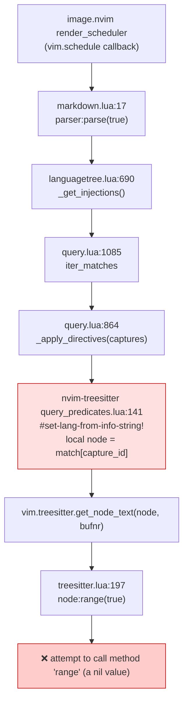
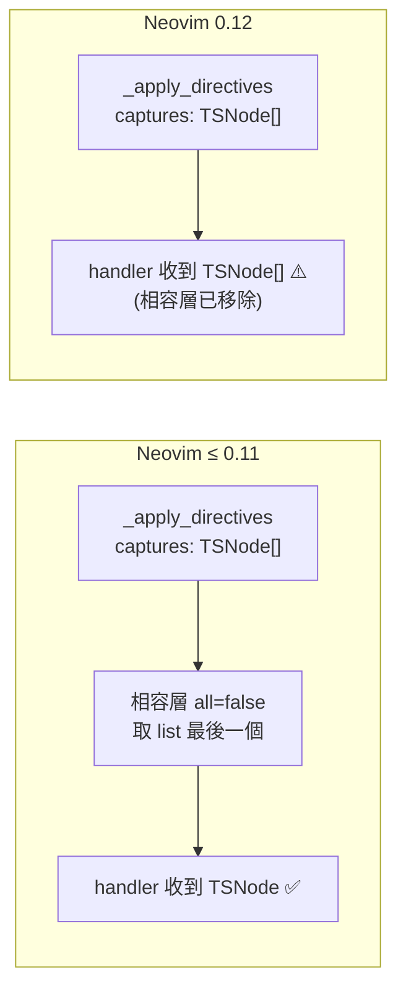

# nvim-treesitter master 與 Neovim 0.12 不相容：`attempt to call method 'range' (a nil value)`

- 日期：2026-08-15
- 環境：NVIM v0.12.4 (Homebrew) / macOS
- 觸發：開啟含 fenced code block 的 markdown 檔，image.nvim 的 render scheduler 回呼中拋錯

## 一、問題摘要

image.nvim 在 `vim.schedule` 回呼中呼叫 `parser:parse(true)`，解析 markdown injections 時，
nvim-treesitter 註冊的 directive `#set-lang-from-info-string!` 把「節點清單」當成「單一節點」
傳進 `vim.treesitter.get_node_text()`，最終在 `node:range(true)` 炸掉。

**根因不在 image.nvim**，image.nvim 只是第一個把錯誤暴露出來的呼叫端。

## 二、根因

Neovim 0.12 移除了 `vim.treesitter.query.add_directive()` / `add_predicate()` 的
`opts.all = false` 向後相容拆包層。0.12 之後 handler 的 `match` 參數**一律**是
`table<integer, TSNode[]>`（每個 capture id 對應一個節點「陣列」）。

nvim-treesitter **master 分支**仍依賴那層相容 shim：

```lua
-- lua/nvim-treesitter/query_predicates.lua:19
local opts = vim.fn.has "nvim-0.10" == 1 and { force = true, all = false } or true
```

0.12 的 `add_directive` 只認得 `opts.force`，`all` 被靜默忽略：

```lua
-- runtime/lua/vim/treesitter/query.lua:794
function M.add_directive(name, handler, opts)
  if type(opts) == 'boolean' then opts = { force = opts } end
  opts = opts or {}
  if directive_handlers[name] and not opts.force then ... end
  directive_handlers[name] = handler   -- 沒有任何 all/unwrap 處理
end
```

於是 `match[capture_id]` 回傳的是 Lua table（無 metatable），`node:range` 為 nil。

### 呼叫鏈





## 三、證據（最小復現）

```lua
vim.opt.runtimepath:prepend("~/.local/share/nvim/lazy/nvim-treesitter")
require("nvim-treesitter.query_predicates")
-- buffer 內容：```lua / print(1) / ```
vim.treesitter.get_parser(buf, "markdown"):parse(true)
```

輸出：

```
[files] { ".../lazy/nvim-treesitter/queries/markdown/injections.scm" }
[parse] ok=false
[parse] err=.../0.12.4/.../vim/treesitter.lua:197: attempt to call method 'range' (a nil value)
[probe] type=table  #=1  elem1=userdata      <-- 確認收到的是 list，不是 node
```

`--clean`（不含 nvim-treesitter）時不會出錯，因為用的是 Neovim 內建的
`queries/markdown/injections.scm`（不含此 directive）。nvim-treesitter 的 query 檔
會覆蓋內建版本，所以只要裝了它就會踩到。

## 四、影響範圍

`query_predicates.lua` 內 6 個 handler 全部有相同錯誤假設：

| 行號 | 名稱 | 類型 |
|---|---|---|
| 51 | `nth?` | predicate |
| 70 | `is?` | predicate |
| 94 | `kind-eq?` | predicate |
| 114 | `set-lang-from-mimetype!` | directive（HTML script 注入）|
| 135 | `set-lang-from-info-string!` | directive（markdown/hurl fenced block 注入）← 本次觸發 |
| 155 | `downcase!` | directive |

為什麼平時編輯 markdown 不會噴這段 stack trace：
`vim/treesitter/highlighter.lua:529` 的 `self.tree:parse()` 跑在 decoration provider 裡，
Neovim 會攔截並停用該 provider（只顯示簡短訊息）。image.nvim 是在 `vim.schedule`
回呼裡裸呼叫，錯誤才完整冒出來。另外 `options.lua:30` 設的
`vim.treesitter.foldexpr()` 也走同一條 injections 路徑，屬同一風險面。

## 五、版本事實

- `nvim-treesitter` 釘選：`master @ cf12346a`（2026-03-23，master 封存前最後一版）
- 該 commit 標題即 `docs(readme): list support upper bounds`，README 改為：
  > **Neovim 0.10 or 0.11**（Neovim 0.12 is **not supported**）
- 前一個 commit `42fc28ba`：`docs(readme)!: announce archiving of master branch`

也就是說：**上游已明確宣告 master 不支援 0.12，且不會再修**。這不是 bug，是 EOL。

## 六、修復選項

| 方案 | 說明 | 風險 |
|---|---|---|
| A. 降回 Neovim 0.11.x | 最小改動，回到官方支援組合 | 放棄 0.12 新功能；Homebrew 無 `neovim@0.11` formula，需走官方 tarball 或 bob |
| B. 遷移到 nvim-treesitter `main` 分支 | 唯一支援 0.12 的分支 | API 全改（`configs.setup{}` 沒了），需 tree-sitter CLI，NvChad v2.5 相依需一併處理 |
| C. 在自己 config 覆寫這些 handler | 載入 nvim-treesitter 後重新 `add_directive`/`add_predicate`，用 list-aware 版本 | contained、可控；需自行維護，未來遷 main 時移除 |
| D. 移除 nvim-treesitter | 0.10+ treesitter runtime 已在 core，外掛只剩管 parser | 失去 `ensure_installed` 批次安裝；需手動管 parser |

不建議直接改 `~/.local/share/nvim/lazy/` 下的檔案 —— lazy 更新會覆蓋。

### 上游態度（2026-04 查證）

兩張對應 issue 都被 **closed as not planned**（master 已封存，不會修）：

- [nvim-treesitter#8618](https://github.com/nvim-treesitter/nvim-treesitter/issues/8618) — markdown fenced code block 上 `node:range()` nil
- [nvim-treesitter#8636](https://github.com/nvim-treesitter/nvim-treesitter/issues/8636) — `match[id]` 在 0.12 回傳 list

#8636 回報者自貼的 workaround 即本文 C 方案：

```lua
local function get_node(match, id)
  local val = match[id]
  if not val then return nil end
  if type(val) == "table" then return val[1] end
  return val
end
```

### 社群實際走向

| 路線 | 誰在走 | 備註 |
|---|---|---|
| 留 0.11 + 釘 commit | 最大宗 | 「config works today → do nothing urgent」 |
| 遷 `main` 重寫版 | 想留 0.12 的人 | 需 tree-sitter CLI，config 全改 |
| 直接不用這個外掛 | 新裝的人 | 0.10+ runtime 已內建 |
| C 式本地覆寫 | 少數、臨時 | 沒人當長期方案 |

社群 fork [`neovim-treesitter/nvim-treesitter`](https://github.com/neovim-treesitter/nvim-treesitter)（2026-04-09 建立）是**跟著 main 的重寫版**，不是「修好的 master」，救不了舊 API 情境。

### C 方案的跨平台性

C 是純 Lua，只動 `vim.treesitter.query` 的 handler 註冊表，不碰檔案系統/編譯/路徑 →
**Windows / macOS / Linux 完全一致**。實測（macOS, nvim 0.12.4）：

```
[after fix] parse ok = true
[after fix] injected languages = lua
```

真正的跨平台痛點不在 C，而在 `:TSUpdate` 編 parser 需要原生 C 編譯器
（Windows 的 Cygwin gcc 迴避邏輯已在 `lua/configs/bootstrap.lua`）—— 選 A/B/C/D 都躲不掉。

### 建議

跨三平台共用 config 的情境下，**版本一致性 > 追新**，A 最省事且是社群主流。
C 可作臨時止血，但不宜當終局（master 整體 EOL，install 模組與新 parser 相容性遲早再踩）。

## 七、處理結果（2026-08-15 完成）

選定 **A（降回 0.11.7）**。實際落地與原方案的一處偏離：

> **不裝到 `/usr/local`，改裝到 `~/.local/opt/nvim-<ver>` + symlink 到 `~/.local/bin/nvim`。**
> 原因：`/usr/local` 需要 sudo 密碼，而 `script/setup-macos.sh` 開頭就寫明
> 「除 Homebrew 官方安裝器外不用 sudo」——走 `~/.local` 反而符合腳本既有設計。
> 本機 PATH 中 `~/.local/bin` 已排在 `/opt/homebrew/bin` 之前，故釘版會正確生效。

| 項目 | 動作 |
|---|---|
| 本機 macOS | `brew uninstall neovim`（0.12.4）→ `~/.local/opt/nvim-0.11.7` + symlink |
| `script/setup-macos.sh` | `neovim` 移出 `REQUIRED`；新增 `NVIM_VERSION` + `install_neovim_pinned()` |
| `setup-nvchad.sh` | `releases/latest` → 釘 `v0.11.7`；guard 由 `-lt 11` 改為「必須剛好 0.11.x」 |
| `setup-nvchad.ps1` | 新增 `Get-NvimVersion` / `Install-NeovimPinned`，winget `--version 0.11.7` + `winget pin add` |
| `lua/plugins/init.lua` | 補 `main = "nvim-treesitter.configs"` |
| 套件 | 補裝 9 個 OPTIONAL（含 filebrowser / imagemagick / chafa） |

### 驗證證據

```
nvim=0.11.7
markdown parse ok=true              ← 原始 crash 消失
injected=lua, markdown_inline, python
highlight.enable=true               ← 修 main 之前是 false
indent.enable=true
ts_hl_active=true                   ← 修 main 之前是 false
parser 檔數 = 22                     ← 修 main 之前是 0
```

### 順帶修掉的兩個 set -e 地雷

1. `nvim --version | head -1` 在 `set -o pipefail` 下，head 提早關管線會讓 nvim 收到
   SIGPIPE（exit 141）被誤判成失敗 → 改用 `sed -n '1p'`。
2. `[[ -n "$X" ]] && info ...` 條件為假時整段回傳 1，在 `set -e` 下會直接中斷腳本
   → 改寫成完整 `if` 區塊。

### 尚未驗證

`setup-nvchad.ps1` 無法在 macOS 上做語法檢查（本機無 pwsh，cask 安裝需 sudo）。
已人工複查括號配對、續行反引號、函式定義早於使用。**請在 Windows 端跑一次**：

```powershell
$e = $null
[System.Management.Automation.Language.Parser]::ParseFile("$PWD\setup-nvchad.ps1", [ref]$null, [ref]$e)
$e
```

## 八、待辦

- [ ] 決定走 A / B / C
- [ ] 若走 C：在 `lua/plugins/init.lua` nvim-treesitter spec 的 `config` 尾端加覆寫，並補測試 markdown fenced block 不再噴錯
- [ ] 確認 `vim.treesitter.foldexpr()` 在 markdown 下的 fold 行為修復後正常
- [ ] 檢查其他相依 treesitter 舊 API 的外掛（`nvim-ts-context-commentstring`、`nvim-ts-autotag`）在 0.12 是否也有同類問題

## 相關檔案

- `lua/plugins/init.lua:116`（nvim-treesitter spec）
- `lua/plugins/init.lua:254`（image.nvim spec）
- `lua/options.lua:30`（foldexpr）
- `~/.local/share/nvim/lazy/nvim-treesitter/lua/nvim-treesitter/query_predicates.lua:19,141`
- `/opt/homebrew/Cellar/neovim/0.12.4/share/nvim/runtime/lua/vim/treesitter/query.lua:794`
- `/opt/homebrew/Cellar/neovim/0.12.4/share/nvim/runtime/lua/vim/treesitter.lua:197`
