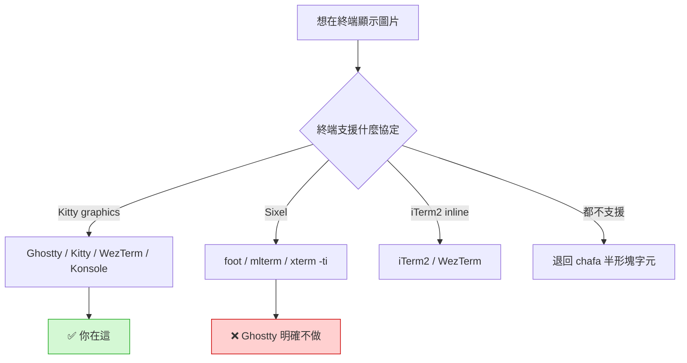

# 終端機圖片 / PDF 顯示：能力盤點與生態系彙整

- 日期：2026-08-16
- 觸發：有了 Ghostty 之後，想在終端機裡看圖與 PDF
- 性質：實作前的技術選型調查（尚未動工）

## 一、本機實測到的硬事實

| 項目 | 現況 |
|---|---|
| Ghostty | 1.3.1（`/Applications/Ghostty.app`） |
| 設定檔 | `configs/ghostty.config`（repo 內）→ `~/.config/ghostty/config` |
| tmux | 3.7b，**兩份 tmux.conf 都沒有 `allow-passthrough`** ⚠️ |
| chafa | 1.18.2，輸出格式支援 `iterm / kitty / sixels / symbols` |
| ImageMagick | 7.1.2-29 ✅ |
| Ghostscript (`gs`) | ❌ 未安裝（snacks.nvim 渲染 PDF 需要） |
| `mmdc`（mermaid CLI） | ❌ 未安裝 |
| timg / viu / tdf / termpdf | ❌ 全未安裝 |
| image.nvim | 已裝，backend 目前解析為 `kitty` |

## 二、決定性限制：Ghostty 不做 Sixel

Ghostty **刻意不支援 Sixel**，只支援 Kitty graphics protocol。官方 discussion #2496 的理由是
「edge cases 太多、libsixel 品質不佳、效能影響不明但非零」。這不是還沒做，是決定不做。

**影響**：任何「只支援 Sixel」的方案在這台機器上直接出局。
`image.nvim` 內建的 `sixel.lua` backend 對你而言是死碼。



## 三、你一定會踩的坑：tmux

Kitty graphics protocol 走 APC escape sequence，**tmux 預設會把它吃掉**。必須開：

```tmux
set -g allow-passthrough on
```

（tmux 3.3a+ 才有此選項；你是 3.7b，可用。）

即使開了，tmux 下的圖形仍有已知限制：捲動 / 換 pane 時殘影或不重繪，因為 tmux 不理解
圖片佔用的儲存格。多數人的結論是**看圖時就不要在 tmux 裡**，或接受偶爾要 `C-l` 重繪。

這是你的環境最需要先決定的事：**要不要為了看圖而調整 tmux 使用習慣**。

## 四、生態系彙整

### A. CLI 圖片檢視器

| 工具 | 語言 | Kitty 協定 | 特色 | 適合你嗎 |
|---|---|---|---|---|
| **timg** | C++ | ✅ 自動偵測 | **能播影片**、平行解碼（grid 場景比 chafa 快 3-5×）、多協定 fallback | ⭐ 最全面 |
| **chafa** | C | ✅ `-f kitty` | 格式最多（含 SVG via librsvg）、多種 dithering、退化模式最好 | 已裝 |
| **viu** | Rust | ✅ 原生 | 小而快，iTerm/Kitty 原生支援 | 輕量首選 |
| `kitty +kitten icat` | — | ✅ | 參考實作，但**綁死 Kitty 終端** | ❌ 不適用 |
| catimg | C | ❌ | 只有塊字元 | ❌ |

> 你已經有 chafa。要加的話 **timg** 補的是「影片」與「速度」，viu 補的是「輕量」。

### B. PDF

| 工具 | 語言 | 做法 | 備註 |
|---|---|---|---|
| **tdf** | Rust | ratatui TUI，主打大檔也順 | 現在最活躍的終端 PDF viewer |
| **termpdf.py** | Python | PyMuPDF + Kitty 協定，支援 pdf/epub/cbz | 老牌，功能完整（註解、選字） |
| `pdftoppm` / `mutool` + icat | — | 自己轉圖再顯示 | 最土砲但最可控 |
| **snacks.nvim image** | Lua | 在 nvim 內直接開 PDF | 需要 `gs` |

### C. Neovim 整合（這是重點）

| 外掛 | 現況 | 能力 |
|---|---|---|
| **image.nvim**（`3rd/image.nvim`） | **你已裝** | markdown 內嵌圖、telescope 預覽；backend: kitty / ueberzug / sixel |
| **snacks.nvim `image`**（folke） | 未裝 | 影像 + **PDF + LaTeX 數學式 + Mermaid 圖**，用 Treesitter 抓文件內嵌來源 |
| diagram.nvim（`3rd/diagram.nvim`） | 未裝 | 專門渲染 mermaid / plantuml，搭 image.nvim |
| hologram.nvim | 未裝 | 較早期，社群動能已轉移 |

> **snacks.nvim 的 image 模組值得特別看**：它能把 markdown 裡的 ` ```mermaid ` 區塊
> 直接在 buffer 內渲染成圖。你的 CLAUDE.md 明文要求「筆記與 craft 文件善用 mermaid 繪製
> 關聯圖」—— 這條剛好打中你的日常。代價是要裝 `mmdc`（mermaid CLI，走 npm）與 `gs`（PDF）。

### D. 檔案管理器 / 周邊

| 工具 | 說明 |
|---|---|
| **yazi** | Rust 檔案管理器，**自動偵測終端挑最佳圖形協定**，可設定用 tdf 開 PDF |
| presenterm | 終端簡報工具，投影片可內嵌圖片 |

## 五、對照你現有的方案

你目前其實已經有**兩條路**：

1. `image.nvim` —— nvim 內看圖（backend 已正確解析為 kitty）
2. `web_media.lua` + filebrowser —— 丟到瀏覽器看（`<leader>fs`）

第 2 條的存在讓「終端看 PDF」的急迫性降低不少：filebrowser 網頁版本來就能看 PDF 和影片，
而且能從手機/別台機器連。**終端方案的真正價值是「不離開鍵盤」與「SSH 遠端」**，
不是取代瀏覽器。

## 六、建議的優先序（尚未執行）

1. **先開 tmux passthrough** —— 一行設定，不開的話後面全部白搭
2. **驗證 Ghostty 真的能顯示** —— `chafa -f kitty <圖>`，先確認基本盤
3. **想要 mermaid 內嵌 → 評估 snacks.nvim image**（要 `mmdc` + `gs`）
4. **想要終端 PDF → tdf**（獨立工具，不動 nvim）
5. timg / viu 看需求再補；chafa 已能應付大部分靜態圖

## 七、實作結果（2026-08-16 完成，A 路線 / 不裝 LibreOffice）

### 分工

| 格式 | 由誰處理 | 依賴 |
|---|---|---|
| 圖片 | yazi 內建 image | Kitty unicode placeholders |
| pdf | yazi 內建 pdf | `pdftoppm`（poppler） |
| md | yazi 內建 code；`glow` 為 opener | glow |
| csv | 本 repo `office.yazi` | `column`（POSIX 內建） |
| xlsx | 本 repo `office.yazi` | `xlsx2csv`（uv tool） |
| docx | 本 repo `office.yazi` | `pandoc` |
| pptx | 本 repo `office.yazi` | `unzip` + `sed`（零額外依賴） |

### 為什麼自己寫外掛而不用現成的

- `macydnah/office.yazi`：功能完整，但走 `libreoffice --headless` → 要背 GB 級相依。**排除**。
- `Urie96/preview.yazi`：不用 LibreOffice，但**不支援 pptx**，且相依清單很長
  （ffmpegthumbnailer / unar / exiftool / nbconvert / smali / transmission-cli…）。**排除**。
- `pptx2md` v2.0.6：**實測會漏內文** —— 測試檔裡的「要點 A」確實存在（python-pptx 直讀可見），
  但 pptx2md 輸出只剩標題；且 loguru 的 INFO log 印在 **stdout**，用 `-o /dev/stdout`
  會和內容混在一起。**排除**。

最後採用 unzip + sed 直接抽 `ppt/slides/slideN.xml` 的 `<a:t>`：零額外依賴、不漏內容、
比 Python 方案快（無直譯器啟動成本）。`sort -V` 是必要的，否則 slide10 會排在 slide2 前。

### 踩到的三個坑（都已修）

1. **Lua 長字串被提前關閉**：pptx 腳本裡的 POSIX 字元類 `[[:space:]]` 結尾是 `]]`，
   會把 `[[ ]]` 字串截斷，報 `unexpected symbol near '$'`。改用 `[==[ ]==]`。
2. **yazi 26.x 的規則欄位是 `url` 不是 `name`**：舊文件寫 `name`，實際會噴
   `at least one of "url" or "mime" must be specified`。`[plugin]` 與 `[open]` 兩處都要改。
3. **`yazi --help` 本身就會驗證設定** —— 這是最快的 config 檢查方式，比開起來再看有用。

### 驗證方式

無 TTY 的環境用 `script` 造 pty，並補 `LINES/COLUMNS`（否則 yazi 報
`failed to get terminal dimension`）：

```bash
( sleep 6; printf 'q' ) | LINES=40 COLUMNS=140 script -q /dev/null yazi t.pptx
```

實測四種格式都在真實 yazi session 中渲染出「只可能來自轉換管線」的文字：

```
pptx → 簡報標題 / 副標題內容 / 第二頁
docx → 測試標題 / 這是一段內文 / 項目一
xlsx → 姓名（經 xlsx2csv）
csv  → 姓名
```

### tmux

`script/devtools/tmux.conf` 加了三行（`~/.tmux.conf` 是它的 symlink，改一份即可）：
`allow-passthrough on` + 轉發 `TERM` / `TERM_PROGRAM`。
**必須 `tmux kill-server` 才生效**，reload 不夠。

## 八、待辦

- [ ] 決定要不要為看圖調整 tmux 使用習慣（或只在非 tmux 分頁看圖）
- [ ] `configs/ghostty.config` 是否需要為圖形協定加設定（待查，預設應該就能用）
- [ ] 若採用 snacks.nvim image：與現有 image.nvim 二選一，避免兩者搶同一塊渲染
- [ ] IMAGE_PREVIEW_GUIDE.md 需更新（目前以 chafa 為主，未涵蓋 Ghostty 的 Kitty 協定）

## 參考

- [Ghostty Sixel Support discussion #2496](https://github.com/ghostty-org/ghostty/discussions/2496)
- [Kitty graphics protocol 規格](https://github.com/kovidgoyal/kitty/blob/master/docs/graphics-protocol.rst)
- [timg](https://github.com/hzeller/timg) / [viu](https://github.com/atanunq/viu)
- [tdf](https://github.com/itsjunetime/tdf) / [termpdf.py](https://github.com/dsanson/termpdf.py)
- [snacks.nvim image 文件](https://github.com/folke/snacks.nvim/blob/main/docs/image.md)
- [yazi](https://github.com/sxyazi/yazi)
